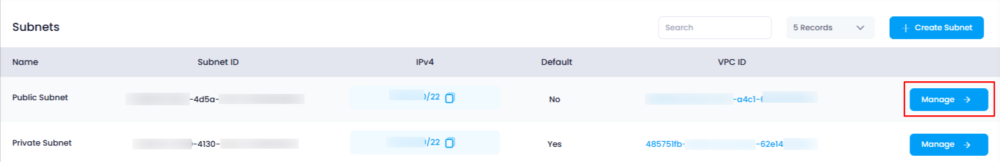
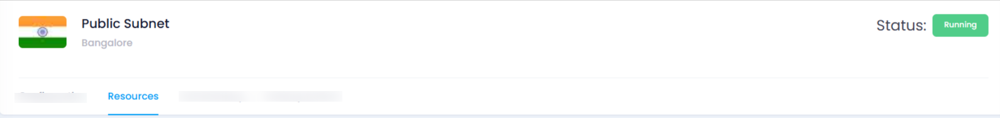

## **How to View Attached Resources in Utho Cloud**

### **Overview**

Viewing the attached resources to a subnet in Utho Cloud allows users to manage and track the cloud resources (such as cloud servers) that are connected to a specific subnet. By accessing the subnet's manage page and navigating to the "Resources" tab, users can easily view all the resources currently associated with that subnet.

---

### **1. Login to Utho Cloud Platform**

* Visit the Utho Cloud Platform's **[Login](https://console.utho.com/login)** page.
* Enter your credentials and click  **Login** .
* If you're not registered, sign up  **[here](https://console.utho.com/signup)** .

---

### **2. Navigate to the Subnet Listing Page**

* On the left sidebar of the platform, look for the **VPC** menu item.
* Under the **VPC** section, select **Subnets** (subsection).
* Clicking on **Subnets** will redirect you to the  **Subnets Listing Page** , where you can view all the subnets created within your account.

You can also access the Subnets listing directly by clicking this [link to Subnet Listing](https://console.utho.com/vpc/subnets "Subnets Listing Page").

---

### **3. Select the Subnet and Open the Manage Page**

* In the  **Subnets Listing Page** , choose the subnet for which you want to view the attached resources.
* At the end of the subnet item, click the **"Manage"** button to open the **Manage Page** of that subnet.

  

---

### **4. Navigate to the "Resources" Tab**

* On the **Manage Page** of the subnet, look for the **"Resources"** tab.
* Click on the **"Resources"** tab to load the list of all resources currently attached to that subnet.

  

---

### **5. View Attached Resources**

Once the **"Resources"** tab is selected, you will be able to view all the resources attached to the subnet. This could include cloud servers, network interfaces, or any other resources linked to that subnet.

---

### **Conclusion**

By following these steps, you can easily view all resources attached to any subnet in Utho Cloud. The **Resources** tab in the **Manage Page** provides a detailed list of all resources currently connected to that subnet, enabling you to manage and track them efficiently.
