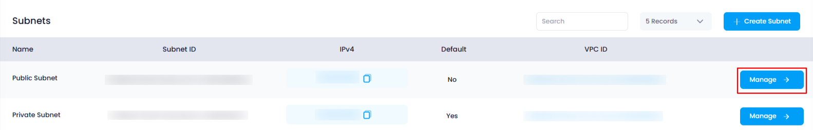
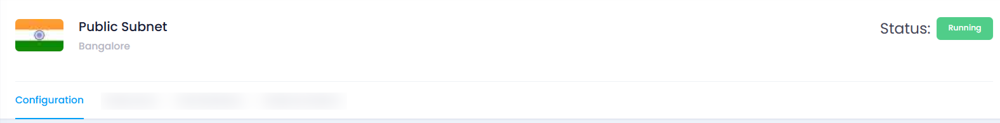
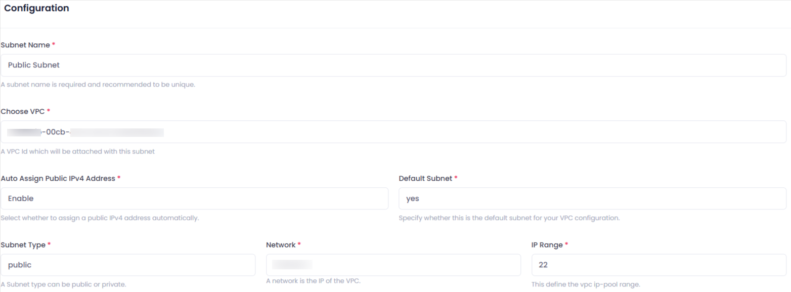

## **How to View Subnet Configuration in Utho Cloud**

### **Overview**

Viewing the configuration of your subnets in Utho Cloud allows users to check and manage the details of their network configurations. This includes subnet name, IP range, type, VPC association, and more. By accessing the subnet's manage page, users can verify or modify the configuration settings of a specific subnet.

---

### **1. Login to Utho Cloud Platform**

* Visit the Utho Cloud Platform's **[Login](https://console.utho.com/login)** page.
* Enter your credentials and click  **Login** .
* If you're not registered, sign up  **[here](https://console.utho.com/signup)** .

---

### **2. Navigate to the Subnet Listing Page**

* On the left sidebar of the platform, look for the **VPC** menu item.
* Under the **VPC** section, select **Subnets** (subsection).
* Clicking on **Subnets** will redirect you to the  **Subnets Listing Page** , where you can view all the subnets created within your account.

You can also access the Subnets listing directly by clicking this [link to Subnet Listing](https://console.utho.com/vpc/subnets "Subnet Listing Page").

---

### **3. View Subnet Configuration**

To view the configuration of a specific subnet, follow these steps:

1. **Select the Subnet**
   * On the  **Subnets Listing Page** , you will see a list of all subnets created.
   * Identify the subnet you want to view the configuration for.
2. **Click on the "Manage" Button**
   * At the end of the subnet item in the list, you will find a **"Manage"** button.
   * Click the **"Manage"** button, which will take you to the **Manage Page** of that specific subnet.

     
3. **Go to the "Configuration" Tab**
   * On the **Manage Page** of the subnet, the **"Configuration"** tab is usually selected by default.
   * If the "Configuration" tab is not selected, you can simply click on it to view the configuration settings.

     
4. **Subnet Configuration Details**
   Once you are in the **Configuration** tab, you will be able to view the following details of the subnet:
   * **Subnet Name** :
     * Displays the name of the subnet as configured during creation.
   * **VPC ID** :
     * Shows the ID of the VPC to which this subnet belongs.
   * **Auto Assign Public IPV4 Address** :
     * Displays whether public IP addresses are automatically assigned to resources in the subnet (Enable/Disable).
   * **Default Subnet** :
     * Indicates whether the subnet is the default subnet for the VPC (Yes/No).
   * **Subnet Type** :
     * Displays whether the subnet is **Public** or  **Private** .
   * **Network** :
     * Shows the **IP address** for the subnet.
   * **IP Range** :
     * Displays the **subnet mask** used for the subnet (e.g., 24, 22), indicating the available range of IP addresses for the subnet.

---

### **Conclusion**

By following these steps, you can easily view the configuration of any subnet in Utho Cloud. The **Configuration** tab provides a clear overview of the subnet's settings, such as its name, associated VPC, subnet type, IP address range, and more. This ensures that users can review and manage subnet configurations for efficient network management.
