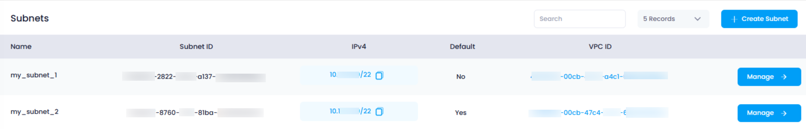

## **How to View Subnets in Utho Cloud**

### **Overview**

Viewing the subnets attached to your Virtual Private Clouds (VPCs) in Utho Cloud enables you to manage the network configuration within your VPCs more effectively. The subnets listing page provides an overview of all the subnets created, along with important details like subnet name, IP range, and which VPC the subnet belongs to. You can also manage each subnet directly from this page.

---

### **1. Login to Utho Cloud Platform**

* Visit the Utho Cloud Platform's **[Login](https://console.utho.com/login)** page.
* Enter your credentials and click  **Login** .
* If you're not registered, sign up  **[here](https://console.utho.com/signup)** .

---

### **2. Navigate to the Subnets Listing Page**

* On the left sidebar of the platform, look for the **VPC** menu item.
* Under the **VPC** section, select **Subnets** (subsection).
* Clicking on **Subnets** will redirect you to the **Subnets Listing Page** where you can view all the subnets that have been created within your account.

You can also access the subnets listing directly by clicking this link to[ Subnet Listing Page](https://console.utho.com/vpc/subnets).

---

### **3. Subnets Listing Page Overview**

On the  **Subnets Listing Page** , you will see a list of all the subnets that have been created in your VPCs. Each subnet in the list will display the following details:

1. **Name**
   * The **Name** is the identifier given to the subnet at the time of creation.
   * It helps you recognize and differentiate between various subnets within your VPC, such as distinguishing between a public or private subnet.
2. **Subnet ID**
   * The **Subnet ID** is a unique identifier automatically assigned to each subnet upon creation.
   * This ID is used for reference in configurations and operations and helps you distinguish between multiple subnets.
3. **IPV4**
   * The **IPV4** field shows the **IP range** (CIDR block) assigned to the subnet, such as `10.137.0.0/24`.
   * This range defines the available IP addresses for resources within the subnet.
4. **Default**
   * The **Default** field indicates whether the subnet is the default subnet for the VPC.
   * If marked as "YES," this subnet is the primary subnet used by the VPC, and "NO" indicates it is a secondary or non-default subnet.
5. **VPC ID**
   * The **VPC ID** displays the unique identifier for the **VPC** to which this subnet belongs.
   * This helps you track which VPC the subnet is a part of, especially when you have multiple VPCs with associated subnets.
6. **Manage Button**
   * The **Manage Button** allows you to access the **Manage Page** for the selected subnet.
   * By clicking this button, you can configure the subnet’s properties, update settings, and manage its attached resources.

---

### **Conclusion**

Viewing subnets in Utho Cloud provides a clear overview of the network configuration within your VPCs. The subnets listing page shows key details such as the subnet name, IP range, VPC ID, and default status, along with easy access to manage each subnet. This helps you ensure that your VPC’s network infrastructure is properly organized and secure.
