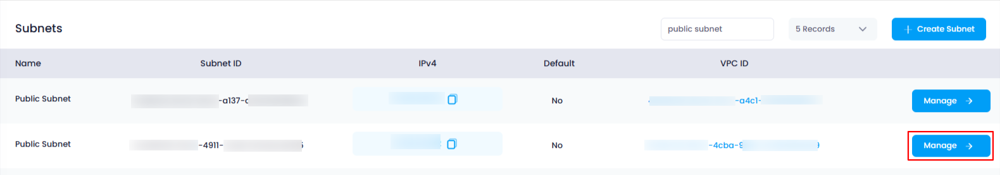
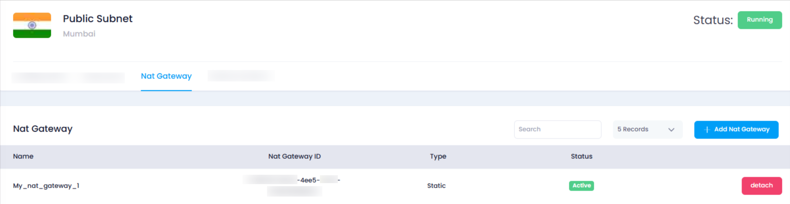

## **How to View Attached NAT Gateways for a Subnet**

### **Overview**

Viewing the attached NAT Gateways for a subnet in Utho Cloud allows users to manage network traffic between their subnet and the internet. By accessing the subnet's manage page and navigating to the "NAT Gateway" tab, users can view all the NAT Gateways that are associated with the subnet and also detach them if necessary.

---

### **1. Login to Utho Cloud Platform**

* Visit the Utho Cloud Platform's **[Login](https://console.utho.com/login)** page.
* Enter your credentials and click  **Login** .
* If you're not registered, sign up  **[here](https://console.utho.com/signup)** .

---

### **2. Navigate to the Subnet Listing Page**

* On the left sidebar of the platform, look for the **VPC** menu item.
* Under the **VPC** section, select **Subnets** (subsection).
* Clicking on **Subnets** will redirect you to the  **Subnets Listing Page** , where you can view all the subnets created within your account.

You can also access the Subnets listing directly by clicking this [link to Subnet Listing](https://console.utho.com/vpc/subnets "Subnets Listing Page")

---

### **3. Select the Subnet and Open the Manage Page**

* In the  **Subnets Listing Page** , choose the subnet for which you want to view the attached NAT Gateways.
* At the end of the subnet item, click the **"Manage"** button to open the **Manage Page** of that subnet.
  

---

### **4. Navigate to the "NAT Gateway" Tab**

* On the **Manage Page** of the subnet, look for the **"NAT Gateway"** tab.
* Click on the **"NAT Gateway"** tab to load the list of all NAT Gateways attached to the subnet.

---

### **5. View Attached NAT Gateways**

Once you click on the **"NAT Gateway"** tab, a list of NAT Gateways attached to that subnet will be displayed. Each NAT Gateway will have the following options:

* **NAT Gateway Name** : The name of the NAT Gateway attached to the subnet.
* **ID** : A unique identifier for the NAT Gateway.
* **Status** : The current status of the NAT Gateway (e.g., active, inactive).
* **Detach Button** : At the end of each NAT Gateway entry, there will be a **"Detach"** button. You can click this button if you want to detach the NAT Gateway from the subnet.

  

---

### **Conclusion**

By following these steps, you can easily view and manage the NAT Gateways attached to your subnets in Utho Cloud. The **"NAT Gateway"** tab in the **Manage Page** provides an overview of all attached NAT Gateways, and you can detach them with just a few clicks if needed.
