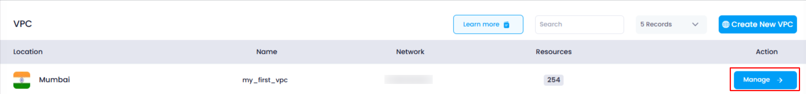
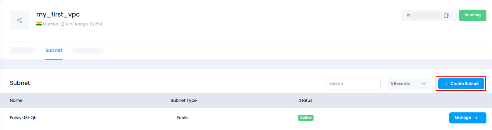
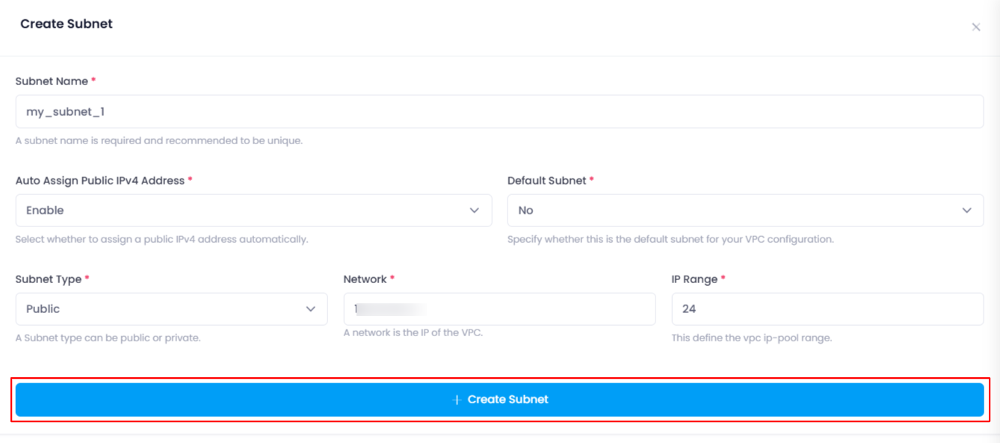
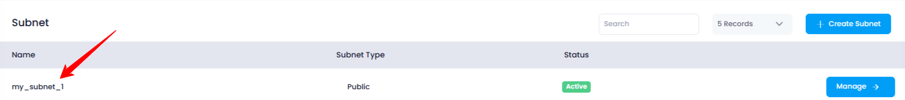

## **How to Create a Subnet**

### **Overview**

Subnets are used to divide a VPC's network into smaller segments, allowing you to better organize and control your resources. In Utho Cloud, you can create a subnet by configuring key network parameters and selecting various options for how it should function.  The subnet created thorugh VPC's manage page automatically gets attached to the selected vpc. This guide will walk you through the steps to create a subnet in your VPC.

---

### **1. Login to Utho Cloud Platform**

* Visit the Utho Cloud Platform's **[ Login](https://console.utho.com/login)** page.
* Enter your credentials and click  **Login** .
* If you're not registered, sign up  **[here](https://console.utho.com/signup)** .

---

### **2. Navigate to the VPC Management Page**

* Once logged in, go to the **VPC** section in the sidebar.
* Under  **VPC** , click on **VPCs** to access the  **VPC [Listing Page](https://console.utho.com/vpc "VPC Listing Page")** .
* Click on the **Manage Button** of the VPC where you want to create the subnet to go to the  **VPC Management Page** .

  

---

### **3. Access the Subnets Section**

* On the  **VPC Management Page** , click on the **Subnet** tab to view the existing subnets of the selected VPC.

---

### **4. Click on "Create Subnet"**

* At the top of the **Subnets** list, you will see a button labeled  **"Create Subnet"** .
* Click on the **"Create Subnet"** button to open the configuration drawer for creating a new subnet.

  

---

### **5. Fill in the Subnet Configuration**

In the drawer, you need to fill in the following details to configure the new subnet:

1. **Subnet Name** :

* Enter a unique **Name** for the subnet. This name will be used to identify the subnet within the VPC.

2. **Auto Assign Public IPv4 Address** :

* This dropdown menu gives you two options:
  * **Enable** : Choose this option if you want the subnet to automatically assign public IPv4 addresses to the resources created within it.
  * **Disable** : Choose this option if you do not want to automatically assign public IPs to the resources.

3. **Default Subnet** :

* This dropdown allows you to select whether this subnet will be the **Default Subnet** for the VPC.
  * **Yes** : Select this option if this subnet will be the default.
  * **No** : Select this option if you do not want it to be the default.

4. **Subnet Type** :

* This dropdown lets you choose the type of subnet:
  * **Public** : A public subnet allows resources within it to directly access the internet.
  * **Private** : A private subnet restricts internet access for resources within it.

5. **Network** :

* In this text input, enter the network address for the subnet (e.g., `10.0.0.0`). This is used to define the network portion of the IP address for the subnet.

6. **IP Range** :

* This numerical input allows you to define the range of IPs available in the subnet.
  * Typical values might include `24`, `22`, etc. For example, `24` would provide 256 IPs in the subnet.

---

### **6. Click on "Create Subnet"**

* After filling out the necessary fields, click on the **"Create Subnet"** button to initiate the subnet creation.
* The system will begin creating the subnet with the configurations you’ve specified.

---

### **7. Verify the Creation**

* Once the subnet is successfully created, a success toast notification will appear to confirm the creation.
* To verify, you can check the **Subnet** list under the **Subnets** tab in the VPC's management page. The newly created subnet should appear in the list with the correct configuration.

  

---

### **Conclusion**

Creating a subnet in Utho Cloud allows you to organize your VPC into smaller, more manageable network segments. By configuring the subnet name, public IP address settings, default status, type, and network parameters, you ensure that your resources are structured according to your specific needs. After creation, you can verify the success of the deployment and start utilizing the subnet immediately.
