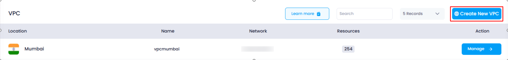
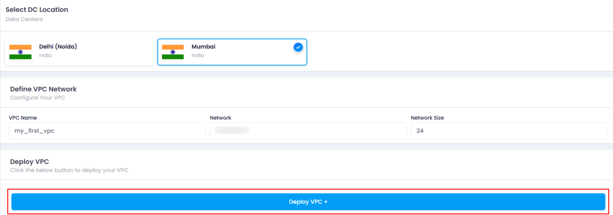
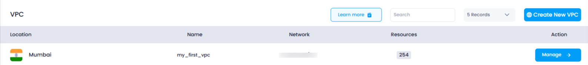

## **How to Deploy a VPC in Utho Cloud**

### **Overview**

Deploying a Virtual Private Cloud (VPC) is a crucial step in creating an isolated network for your cloud resources in Utho Cloud. The VPC setup allows you to define your cloud network’s IP address range, name, and data center location. Once created, you can manage your network resources securely.

---

### **1. Login to Utho Cloud Platform**

* Visit the Utho Cloud Platform's **[Login](https://console.utho.com/login)** page.
* Enter your credentials and click  **Login** .
* If you're not registered, sign up  **[here](https://console.utho.com/signup)** .

---

### **2. Navigate to the VPC Listing Page**

* After logging into the Utho Cloud platform, find the **VPC** section in the sidebar.
* Under  **VPC** , click on **VPCs** (subsection) to access the  **VPC Listing Page** .
* You can also access the VPC listing directly by clicking [here](https://console.utho.com/vpc "VPC Listing Page").

---

### **3. Click on "Create New VPC"**

* On the  **VPC Listing Page** , locate the **"Create New VPC"** button at the top of the page.
* Click the **"Create New VPC"** button to be redirected to the VPC Deployment Page.

  

---

### **4. Fill in VPC Deployment Details**

On the  **VPC Deployment Page** , you will need to provide the following inputs to create a new VPC:

#### **a. DC Location**

* This is where you will choose the **data center location** where you want your VPC to be deployed. Utho Cloud provides multiple data center locations, and selecting one depends on your regional preferences or requirements.

#### **b. VPC Name**

* Enter a **name** for your VPC. This name will help you easily identify and manage the VPC in the future, especially if you have multiple VPCs.

#### **c. Network**

* Enter an **IP address range** for the network. This will define the IP block that your VPC will use. For example, you might enter something like `10.137.0.0/20`. This ensures that your VPC is assigned a specific subnet of IP addresses.

#### **d. Network Size**

* Enter the **network size** as a numeric value. This represents the size of the subnet mask. For example, a value like **24** would define a smaller network range with fewer available IPs, while larger values like **16** would allow more IPs to be assigned within the range.

---

### **5. Deploy the VPC**

* After filling in all the necessary information, click the **"Deploy VPC"** button.
* Utho Cloud will begin the process of deploying the VPC based on the configurations you've provided.

---

### **6. VPC Deployment Success**

* Once the VPC is successfully deployed, you will be redirected to the **VPC Management Page** for your newly created VPC, where you can see the current status of the deployed VPC.

  

---

### **7. Verify VPC Deployment**

* To verify if the VPC has been deployed successfully, return to the  **VPC Listing Page** .
* The newly created VPC should appear in the list, with all the details you provided during deployment, including  **Location** ,  **Name** ,  **Network** , and  **Network Size** .

  

---

### **Conclusion**

Deploying a VPC in Utho Cloud is a straightforward process that enables you to create a secure and isolated network for your cloud resources. Once deployed, you can easily manage your VPC and connect it with other cloud services and resources. By following the steps outlined above, you can quickly set up and customize your VPC to meet your cloud infrastructure needs.
