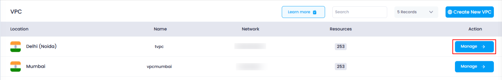
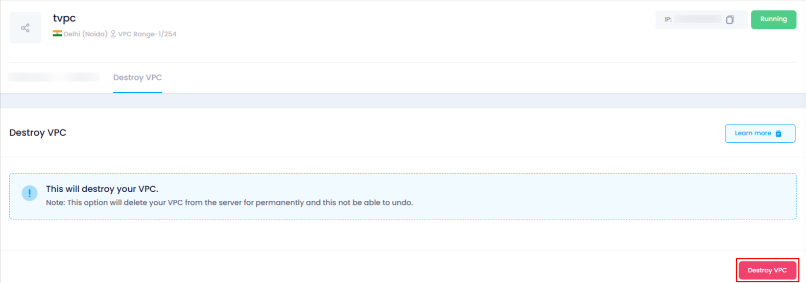
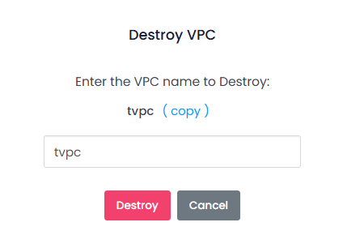

## **How to Destroy a VPC**

### **Overview**

Destroying a VPC in Utho Cloud is the process of permanently deleting the VPC and all associated resources, such as subnets, attached cloud servers, and more. This action should be taken with caution, as once the VPC is destroyed, it cannot be recovered. Below is the step-by-step guide on how to safely destroy a VPC.

---

### **1. Login to Utho Cloud Platform**

* Visit the Utho Cloud Platform's **[ Login](https://console.utho.com/login)** page.
* Enter your credentials and click  **Login** .
* If you're not registered, sign up  **[here](https://console.utho.com/signup)** .

---

### **2. Navigate to the VPC Listing Page**

* After logging in, go to the **VPC** section from the sidebar.
* Click on **VPCs** to access the  **VPC Listing Page** .
* You can also click [here](https://console.utho.com/vpc "VPC Listing Page") to access the page directly.

---

### **3. Select the VPC to Destroy**

* On the  **VPC Listing Page** , you will see a list of all your deployed VPCs.
* At the end of each VPC entry, you will find a **"Manage"** button.
* Click on the **"Manage"** button for the VPC that you wish to destroy. This will take you to the  **VPC Management Page** .

  

---

### **4. Go to the "Destroy VPC" Tab**

* Once on the  **VPC Management Page** , locate and click on the **"Destroy VPC"** tab.
* Clicking on this tab will display the option to destroy the VPC.

---

### **5. Click on "Destroy VPC"**

* In the **"Destroy VPC"** tab, you will find a button labeled  **"Destroy VPC"** .
* Click on the **"Destroy VPC"** button to initiate the process of destroying the VPC.

  

---

### **6. Confirm VPC Destruction**

* After clicking  **"Destroy VPC"** , a confirmation popup will appear asking for the name of the VPC you want to destroy.
* **Enter the name of the VPC** exactly as it appears to confirm that you want to proceed with the destruction. This is a safety measure to prevent accidental deletion.

  

---

### **7. Confirm and Complete the Destruction**

* Once you have entered the VPC name correctly, click the **"Destroy"** button in the confirmation popup.
* The system will process the destruction of the VPC, including all associated resources.
* After the VPC is successfully destroyed, you will be redirected back to the  **VPC Listing Page** .

---

### **8. Verify VPC Destruction**

* After being redirected to the  **VPC Listing Page** , you can verify that the VPC has been destroyed by checking the updated list.
* The VPC that was destroyed should no longer appear in the list.

---

### **Conclusion**

Destroying a VPC in Utho Cloud is a permanent action that requires careful consideration. By following the steps above, you can safely destroy a VPC and ensure that all resources associated with it are deleted. Always double-check the VPC name during the confirmation step to avoid any mistakes. Once destroyed, the VPC cannot be recovered, so proceed with caution.
