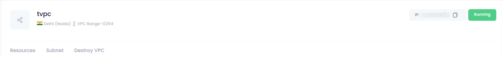

## **Overview of the VPC Manage Page**

### **Introduction**

The **VPC Manage Page** in Utho Cloud provides essential details and configuration options for managing your Virtual Private Cloud (VPC). In this section, you will find key information about the VPC and three tabs that allow you to configure and manage it further.

---

### **VPC Information**

1. **Name of the VPC** :

* The **name** displayed is the identifier of the VPC. It is set during the VPC deployment and is used to easily reference and manage the VPC in the cloud environment.

2. **DC Location of the VPC** :

* This indicates the **data center (DC) location** where the VPC has been deployed. It helps determine the geographical region of the VPC and its associated resources.

3. **VPC Range** :

* The **VPC range** shows the IP address range allocated to the VPC. It is used to manage and allocate IP addresses to various resources within the VPC.

4. **IP of the VPC** :

* This is the **primary IP address** assigned to the VPC. It represents the main network address for routing within the VPC.

5. **Status of the VPC** :

* The **status** indicates whether the VPC is **active** or not. If the status is "Running," the VPC is actively serving the resources and is in use.

---

### **Tabs for Further Configuration**

1. **Resources Tab** :

* This tab displays a list of all the **resources** (like cloud servers, load balancers, etc.) attached to the VPC. It provides a comprehensive view of the VPC's active resources.

2. **Subnet Tab** :

* The **Subnet** tab lists all the subnets within the VPC. It also provides the option to **create new subnets** for more fine-grained network management within the VPC.

3. **Destroy VPC Tab** :

* The **Destroy VPC** tab contains the option to **permanently destroy the VPC** and all associated resources. This option is available only after confirming the VPC name for safety.

---

### **Conclusion**

The top section of the VPC Manage page offers a concise overview of your VPC's status and essential configuration details. The three tabs provide you with the necessary tools to manage resources, create subnets, or destroy the VPC when required.
