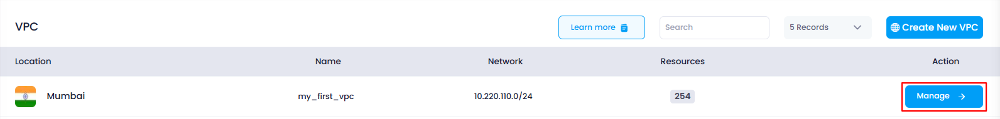
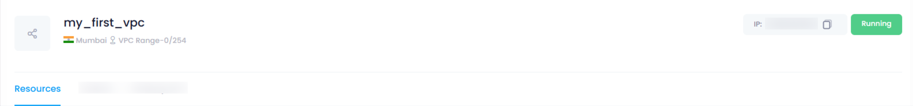

## **How to View the Resources Attached to a VPC**

### **Overview**

In Utho Cloud, you can easily view the resources, such as cloud servers, that are attached to a specific VPC. This helps you manage your cloud infrastructure and ensures that you can quickly identify which resources are linked to your virtual network.

---

### **1. Login to Utho Cloud Platform**

* Visit the Utho Cloud Platform's **[ Login](https://console.utho.com/login)** page.
* Enter your credentials and click  **Login** .
* If you're not registered, sign up  **[here](https://console.utho.com/signup)** .

---

### **2. Navigate to the VPC Listing Page**

* Once logged in, go to the **VPC** section in the sidebar.
* Under  **VPC** , click on **VPCs** to access the  **VPC Listing Page** .
* You can also directly access the VPC listing by clicking [here](https://console.utho.com/vpc "VPC Listing Page").

---

### **3. Select the VPC**

* From the  **VPC Listing Page** , find the VPC for which you want to view attached resources.
* Click on the **Name** of the VPC to access the  **VPC Management Page** .
  

---

### **4. Go to the Resources Section**

* On the  **VPC Management Page** , by default, the **Resources** section will be selected.
* If the **Resources** section is not selected by default, locate the **Resources** tab at the top of the page and click on it.

  

---

### **5. View Attached Resources**

* Once the **Resources** tab is selected, the page will display a list of all the **cloud servers** and other resources attached to that VPC (if any).
* The list will show you details of each resource, such as name, type, and status.

---

### **Conclusion**

Viewing the resources attached to a VPC is a simple process in Utho Cloud. By navigating to the VPC management page and accessing the **Resources** section, you can quickly identify which cloud servers and other resources are connected to your VPC. This helps you efficiently manage your cloud infrastructure and ensure that your resources are correctly associated with the desired VPC.
