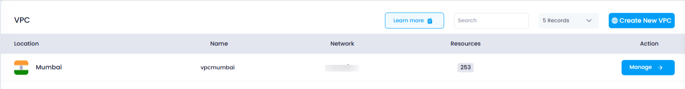

## **How to View VPC in Utho Cloud**

### **Overview**

Viewing your deployed Virtual Private Clouds (VPCs) in Utho Cloud allows users to manage their network environments efficiently. By accessing the VPC listing page, users can see all VPCs previously deployed in their account, along with key details like location, name, network configuration, and available management actions.

---

### **1. Login to Utho Cloud Platform**

* Visit the Utho Cloud Platform's **[ Login](https://console.utho.com/login)** page.
* Enter your credentials and click  **Login** .
* If you're not registered, sign up  **[here](https://console.utho.com/signup)** .

---

### **2. Navigate to the VPC Listing Page**

* On the left sidebar of the platform, look for the **VPC** menu item.
* Under the **VPC** section, select **VPCs** (subsection).
* Clicking on **VPCs** will redirect you to the **VPC Listing Page** where you can view all your deployed VPCs.

You can also access the VPC listing directly by clicking this [link to VPC Listing](https://console.utho.com/vpc "VPC Listing Page").

---

### **3. VPC Listing Page Overview**

On the VPC listing page, you’ll see a list of all the VPCs that have been deployed within your account, including the following details for each VPC:

1. **Location**

   * The **Location** field shows the data center (DC) location where your VPC has been deployed.
   * This information helps you know where your network resources are physically hosted, ensuring that your resources are located in the desired region or data center.
2. **Name**

   * The **Name** is the identifier given to the VPC at the time of deployment.
   * It helps you recognize and differentiate between multiple VPCs, especially when managing several environments (e.g., production, staging).
3. **Network**

   * The **Network** refers to the CIDR block assigned to the VPC at the time of creation. It is represented in a format like `10.137.0.0/20`, which defines the IP address range for the VPC.
   * This field helps you understand the range of IP addresses available for resources within the VPC.
4. **Action**

   * The **Action** button next to each VPC allows you to manage your VPC resources. By clicking this button, you can access options to modify, view detailed configurations, or delete the VPC if necessary.
   * This section provides an easy way to manage each VPC's settings and resources in a few simple clicks.

   

---

### **Conclusion**

Viewing your VPCs in Utho Cloud is an essential part of managing your cloud network resources. The VPC listing page provides a clear overview of all your deployed VPCs along with crucial details such as location, name, network CIDR, and quick access to VPC management actions. By utilizing this page, you can easily monitor and control your network configurations for optimal cloud infrastructure management.

---

If you need any more assistance or further clarification on viewing and managing your VPCs, feel free to reach out!
