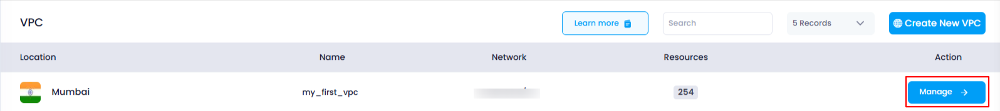
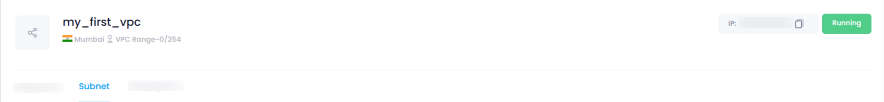
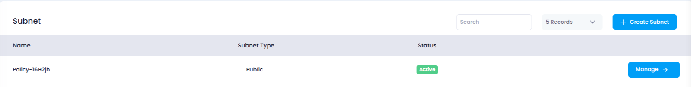

## **How to View the Subnets Attached to a VPC**

### **Overview**

In Utho Cloud, viewing the subnets attached to a VPC is essential for managing your network and ensuring that your cloud resources are properly segmented. You can access detailed information about each subnet, including its name, type, and status, directly from the VPC's management page.

---

### **1. Login to Utho Cloud Platform**

* Visit the Utho Cloud Platform's **[ Login](https://console.utho.com/login)** page.
* Enter your credentials and click  **Login** .
* If you're not registered, sign up  **[here](https://console.utho.com/signup)** .

---

### **2. Navigate to the VPC Listing Page**

* After logging in, go to the **VPC** section in the sidebar.
* Under  **VPC** , click on **VPCs** to access the  **VPC Listing Page** .
* You can also directly access the VPC listing by clicking [here](https://console.utho.com/vpc "VPC Listing Page").

---

### **3. Select the VPC**

* From the  **VPC Listing Page** , locate the VPC for which you want to view attached subnets.
* Click on the **Name** of the VPC to access the  **VPC Management Page** .

  

---

### **4. Go to the Subnets Section**

* On the  **VPC Management Page** , look for the **Subnet** tab at the top of the page.

  
* Click on the **Subnet** tab to see the list of all the subnets attached to the selected VPC.

---

### **5. View Subnet Details**

Once you’ve clicked on the **Subnet** tab, the page will display a list of all subnets associated with the VPC, including the following details:

* **Name** : The name of the subnet, which is used to uniquely identify it within the VPC.
* **Subnet Type** : Indicates whether the subnet is a **Public** or **Private** subnet, determining its accessibility from the internet.
* **Status** : The current operational status of the subnet. It will show if the subnet is **Active** or  **Inactive** .
* **Manage Button** : The **Manage** button redirects you to the subnet’s management page, where you can update subnet configurations, such as IP range and security settings.

  

---

### **Conclusion**

By following the above steps, you can easily view the subnets attached to a specific VPC in Utho Cloud. Accessing the **Subnet** tab allows you to view important information about the subnet's name, type, and status, helping you better organize and control your network configurations.
