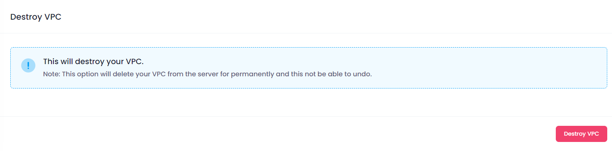

## VPC Configuration Info

At the top of the Manage section, users can view the configuration information of the selected VPC. This includes:

* **VPC Name:** The unique name assigned to the VPC.
* **Datacenter Location:** The chosen datacenter location.
* **VPC Network:** The IP address of the VPC.
* **Status:** The current status of the VPC (e.g., active, inactive, pending).

<!-- * **VPC Network:** The number of VPN users associated with the VPN. -->

## Manage VPC

In the Manage VPC section, users can view the VPCs added to each cloud instance. This section provides the following functionalities:

* **View Cloud:** Click the **View Cloud** button to open the manage section of that cloud.

<!-- * **Remove User:** Select a user from the list and click the **Remove** button to remove the user from the VPN.
* **Download User:** Select a user from the list, click the **Download** button, which will download your vpn user into your brows. -->

## Destroy

In the Destroy section, users can terminate the VPC instance. This action is irreversible and will permanently delete the VPC and all associated data. To destroy a VPC

Click the **Destroy VPC** button.

##### **Confirmation:**

A confirmation dialog will appear. Copy the name of the VPC and paste it into the input box. Confirm the action to proceed with destroying the VPC.

When you provide the confirmation then your VPC will destroy.
