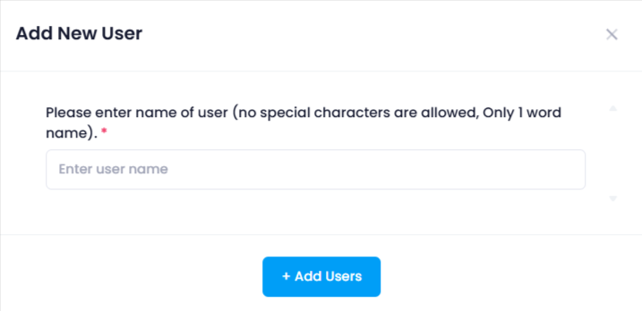

## How to create VPN Users

In the Manage Users section, users can add, delete, and download VPN users. This section provides the following functionalities:

* **Add New User:** Click the **Add New User** button to open a form where you can enter the user details such as username then click on add user, Then VPN user will be created.

### Use of VPN Users in Utho Cloud

**VPN users** connect securely to cloud resources via a VPN, providing:

1. **Secure Remote Access**: Access cloud resources securely from anywhere.
2. **Authentication**: Ensure only authorized users connect.
3. **Data Privacy**: Encrypt communication to protect sensitive data.
4. **Network Segmentation**: Limit user access to specific resources.
5. **Accessing Private Services**: Enable access to internal cloud resources.
6. **Business Continuity**: Maintain access during disruptions.

VPN users ensure secure, controlled access to cloud resources and services.
