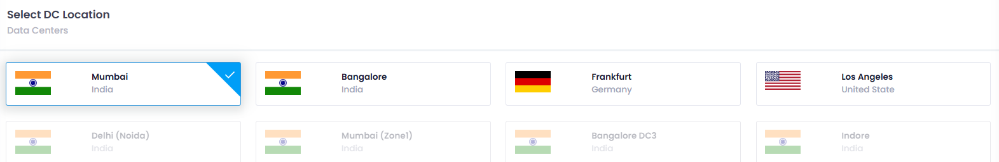
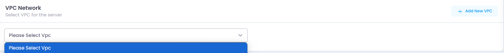
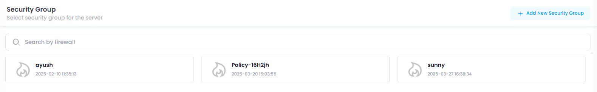
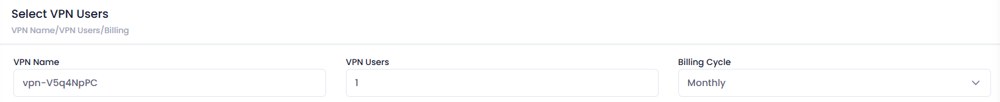
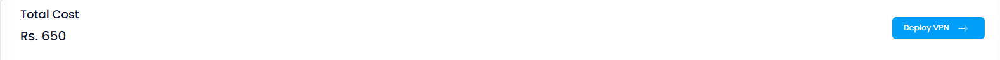
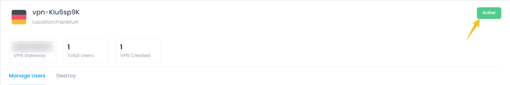

# **How to create VPN**

## **Login or Sign Up**

1. Go to the **Utho Cloud Platform** [login](https://console.utho.com/login) page.
2. Enter your credentials and click  **Login** .
3. If you don't have an account, sign up [here](https://console.utho.com/signup).

---

## **Accessing VPN**

1. Open the **Utho Cloud Platform** dashboard.
2. Click on **"VPN"** in the sidebar.
3. You will be redirected to the **VPN** listing page.
4. Click on **[Deploy New VPN](https://console.utho.com/vpn/deploy)** to open the deployment page.

On the  **Deploy Page** , configure the following:

### Steps to VPN

**Deploy Page of vpn:**

Then a vpn-deploy page will open.

1. **Datacenter Location:** Choose the desired datacenter location from the DC Location list.

   
2. **VPC Network :** Choose Vpc and its subnet (if available) for your VPN.

   
3. **Security Group:** Choose firewall/Security group for your VPN.

   
4. **VPN Name:** Enter a unique name for your VPN.
5. **Number of VPN Users:** Specify the number of VPN users to add.
6. **Billing Cycle:** Select the preferred billing cycle.

   
7. **Review Total Amount:** The total cost will be displayed in the bottom left corner of the page.

   
8. **Deploy VPN:** Click the **Deploy VPN** button on the right side to create your VPN.

### Uses of DC Location, VPC Network, and Security Group in VPN

1. **DC Location (Data Center Location)**:

   - **Definition**: Refers to the physical location of the data center where cloud resources are hosted.
   - **Use in VPN**: The DC location affects latency and performance of the VPN connection. Selecting a data center geographically closer to users or on-premise infrastructure can enhance speed and reduce delays.
2. **VPC Network (Virtual Private Cloud Network)**:

   - **Definition**: A logically isolated network within the cloud provider’s environment that allows you to launch resources in a virtual network.
   - **Use in VPN**: VPN connections often link users or on-premise networks to a VPC, enabling secure communication between the local network and cloud resources. This setup allows resources in the VPC to be accessed securely over the VPN.
3. **Security Group**:

   - **Definition**: A virtual firewall that controls inbound and outbound traffic for resources within a VPC.
   - **Use in VPN**: Security groups define rules that govern which traffic can flow through the VPN connection. They help ensure that only authorized traffic is allowed, enhancing security by restricting access based on IP addresses, protocols, and ports.

#### Verify Deployment:

Your VPN should now be active and visible in the list of deployed VPNs.

Here you can see your deployed vpn with configuration details your provided during the deployment process and you can manage you vpn by clicking on mange button, for detailed info check for the manage vpn section in the Utho docs.
