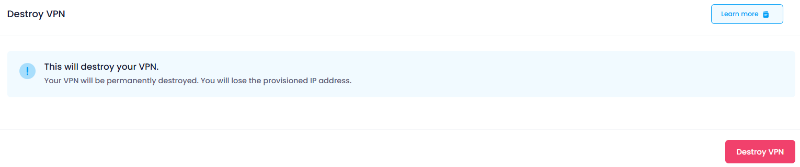
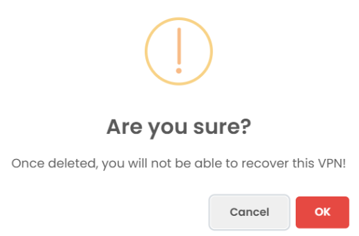

## Destroy

In the Destroy section, users can terminate the VPN instance. This action is irreversible and will permanently delete the VPN and all associated data.

Click the **Destroy VPN** button.

##### **Confirmation:**

A confirmation dialog will appear. Confirm the action to proceed with destroying the VPN.

When you provide the confirmation then your VPN Instance will destroy.
