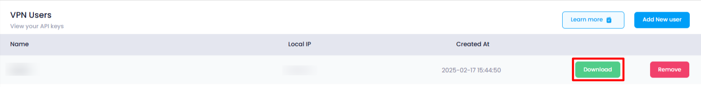

## Download VPN User

* **Download User:** Select a user from the list, click the **[Download]()** button, which will download your vpn user into your browser.

### How to Use a Downloaded VPN

1. **Install the VPN**:

   - Download and install the VPN application on your device (PC, macOS, or mobile).
2. **Open the VPN Client**:

   - Launch the app after installation.
3. **Login**:

   - Enter your **username** and **password** provided by your VPN service.
4. **Choose a Server**:

   - Select a server location (or let the app choose the best one automatically).
5. **Connect**:

   - Click **Connect** to establish a secure VPN connection.
6. **Verify the Connection**:

   - Check that you’re connected and your internet traffic is encrypted.
7. **Use the VPN**:

   - Enjoy secure browsing or accessing private cloud resources.
8. **Disconnect**:

   - Click **Disconnect** once you’re finished using the VPN
