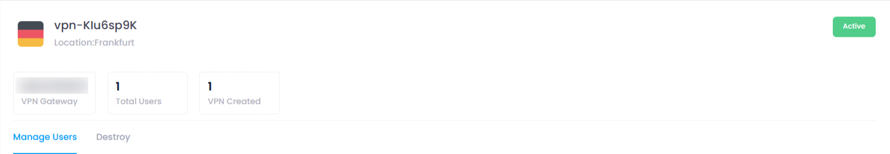

## Overview of manage Section:

    

### VPN Gateway

A **VPN Gateway** is a device or server that connects a private network to the internet or another private network using a secure VPN connection. It acts as an entry point or "gateway" for users or remote sites to access the network securely over the internet. The VPN gateway is responsible for encrypting and decrypting the data transmitted between the internal network and the outside world, ensuring that sensitive information remains protected while in transit. It can be a physical device or a software solution deployed within a network infrastructure.

### Total Users

The **Total Users** refers to the total number of individuals or devices that are authorized to access a specific VPN service or network. This count includes all the active and inactive users who have been given credentials to connect to the VPN. Administrators track the total user count for managing resources, ensuring that the service can handle the load, and maintaining security by revoking access for users who no longer need it.

### VPN Created

**VPN Created** refers to the process of setting up and establishing a new Virtual Private Network (VPN) connection or service. This can involve configuring VPN servers, choosing encryption protocols, creating user accounts, and defining access policies. The term "VPN Created" can also indicate the total number of VPN networks that have been set up within a given system or organization. Once a VPN is created, users can connect to it for secure, encrypted communication between their devices and the network or internet.

### Manage User Section

1. **Creation of User** : This option allows administrators to create new VPN user accounts by assigning usernames, passwords, and access permissions. It enables users to securely connect to the VPN service with their unique credentials. The process typically involves adding the user's details to a secure database and configuring necessary access settings.
2. **Removal of VPN User** : This feature enables administrators to remove or deactivate VPN user accounts that are no longer needed. When a user is removed, they lose access to the VPN network, and their credentials are deleted from the system, ensuring no unauthorized access remains.
3. **Download Option for VPN** : Users can download the VPN software or configuration files needed to connect to the VPN server. This option typically provides downloadable packages for various operating systems (Windows, macOS, iOS, Android) and configuration files for manual setup.

### Destroy Section

    **Destroy Section** : The "Destroy" option is used to permanently deactivate and delete the entire VPN setup, including user accounts, configurations, and server settings. This is typically used when the VPN service is no longer required, ensuring that all associated resources are securely wiped and no access remains.
