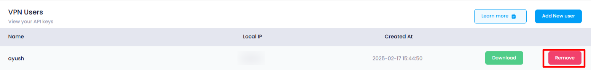

## Remove VPN User

* **Remove User:** Select a user from the list and click the **Remove** button to remove the user from the VPN.

When a VPN user is removed, their access to the VPN network is revoked, and their login credentials become invalid. This means they can no longer connect to the VPN or access any resources within the network. The user’s account, along with any associated permissions or settings, is deleted from the system. Any VPN configurations on their devices will no longer work. This action helps enhance security by ensuring that unauthorized users cannot access sensitive data or systems. Additionally, the removal is often logged for audit and compliance purposes.
