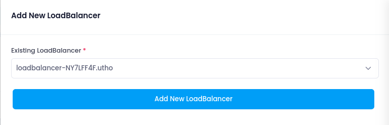

# **Attach LoadBalancer to WAF**

## **Purpose**

Attaching a LoadBalancer to your Web Application Firewall (WAF) enables it to inspect and filter incoming traffic before it reaches your backend services. This helps protect your applications from a wide range of threats such as injection attacks, cross-site scripting, and malicious bots.

---

## **Steps to Attach a LoadBalancer**

### **1. Login to Utho Cloud Console**

1. Go to the [Utho Cloud Console](https://console.utho.com/login).
2. Enter your login credentials and click **Login**.
3. If you don’t have an account, [Sign Up](https://console.utho.com/signup).

---

### **2. Navigate to the WAF Manage Page**

1. From the Utho dashboard sidebar, click on **WAF** under **Security**.
2. You will be directed to the list of created WAFs.
3. Click **Manage** next to the WAF instance you want to configure.

---

### **3. Access the Resources Section**

1. On the WAF Manage page, scroll down or click the **Resources** tab.
2. You’ll see a list of currently attached LoadBalancers (if any), showing:
   - **LB ID**
   - **Type**
   - **Port**
   - **Status**
   - **Created At**

---

### **4. Attach a LoadBalancer**

1. Click on the **Attach LoadBalancer** button.
2. A list of available LoadBalancers (created under your project/account) will be displayed.
3. Select the LoadBalancer you want to protect with this WAF.
4. Click **Attach** to finalize the operation.
   

---

## **What Happens After Attachment**

- The WAF starts filtering and inspecting traffic coming through the selected LoadBalancer.
- Only traffic that passes WAF rules (managed and custom) reaches the backend servers.
- You can monitor the traffic flow and attacks using WAF logs and dashboards.

---

## **Important Notes**

- **One WAF can protect multiple LoadBalancers**, but a LoadBalancer can be attached to only one WAF at a time.
- Ensure that your WAF rules are properly configured before attaching to a live LoadBalancer to avoid blocking legitimate traffic.
- If you later update rules (enable/disable), those updates will apply to all attached LoadBalancers automatically.

---

## **Conclusion**

Attaching a LoadBalancer to a WAF is a critical step to securing your cloud applications from Layer 7 (application-layer) attacks. Once attached, the WAF begins enforcing your defined security policies immediately across incoming traffic.
