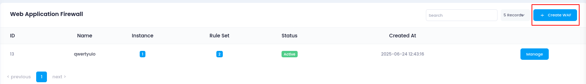
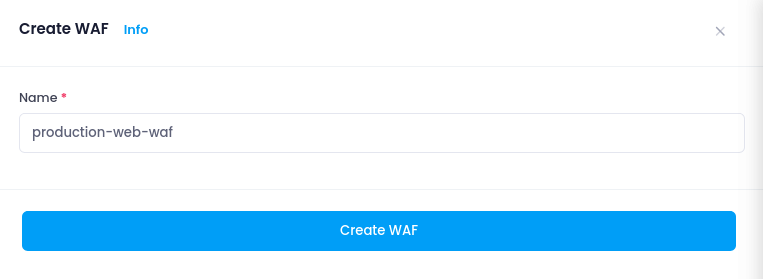

# **How to create WAF**

## **Login or Sign Up**

1. Go to the **Utho Cloud Platform** [login](https://console.utho.com/login) page.
2. Enter your credentials and click **Login**.
3. If you don't have an account, sign up [here](https://console.utho.com/signup).

---

## **Accessing WAF**

1. Open the **Utho Cloud Platform** dashboard.
2. Click on **"WAF"** from the sidebar navigation.
3. You will be redirected to the **WAF listing page**.
4. Click on **[Create WAF](https://console.utho.com/waf/create)** to begin the creation process.
   

---

## **Creating a New WAF**

The WAF creation process on Utho is designed to be quick and user-friendly. You only need to specify one key input to initialize your WAF.

### **Step 1: Enter WAF Name**

- **WAF Name**:Provide a unique and descriptive name for your WAF instance.Examples:
  - `production-web-waf`
  - `api-firewall`
  - `ecommerce-waf-eu`

> The name helps you identify this WAF among others, especially when managing multiple web applications. Choose something meaningful that reflects the environment or purpose.
> 

---

## **Deploying the WAF**

Once you’ve entered a valid name:

1. Click on the **Create WAF** button.
2. Your WAF will now be provisioned and listed on the WAF dashboard.
3. From here, you can proceed to manage and configure advanced rules, attach load balancers, and monitor traffic.

---

## **What Happens After Creation?**

After the WAF is created, you will be able to:

- **Enable Managed Rulesets**:Activate a preconfigured set of security rules to immediately protect against common threats like SQL Injection, XSS, Remote File Inclusions, etc.
- **Add Custom Rules**:Define your own traffic filtering logic such as blocking by IP address, country, user-agent, headers, request method, URI patterns, or even rate limits.
- **Attach Load Balancers**:Bind your WAF to existing Load Balancers tsidebaro protect backend services and inspect all inbound web traffic.
- **Monitor Logs and Activity**:
  View request logs, rule matches, and blocked attacks in real time to evaluate and refine your security posture.

---

## **Best Practices While Creating a WAF**

- Choose a name that reflects the **application, region, or purpose** of the firewall.
- Plan to configure **managed rules** immediately after creation for instant protection.
- Decide whether you'll use **custom rules** for very specific threat vectors in your environment.
- If your application uses a Load Balancer, make sure to **attach it to the WAF** after creation for traffic inspection.

---

## **Next Steps**

Once the WAF is successfully created and appears in your list:

- Click on the **Manage** button to access full configuration options.

---
