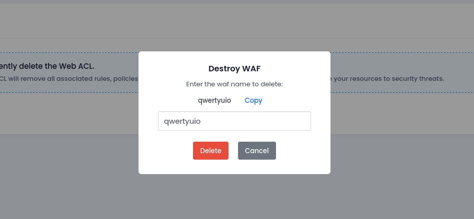

# **Destroy WAF**

## **Purpose**

Destroying a Web Application Firewall (WAF) permanently deletes its configuration, custom rules, managed rulesets, and detaches all associated LoadBalancers. This action is irreversible and should be performed only when the WAF is no longer needed.

---

## **Steps to Destroy WAF**

### **1. Login to Utho Cloud Console**

1. Visit [Utho Cloud Console](https://console.utho.com/login).
2. Enter your login credentials and click **Login**.

---

### **2. Navigate to WAF Listing**

1. From the sidebar, click on **WAF** under the **Networking** section.
2. This opens the list of all deployed WAFs.
3. Locate the WAF instance you wish to delete.

---

### **3. Initiate the Destruction Process**

1. Navigate to the manage page of the WAF you wish to destroy.
2. Move to Destory tab, and click on the **Destroy** button.
3. A confirmation prompt will appear asking you to type the **WAF name** to proceed.

> ⚠️ This step is a safeguard against accidental deletions.

---

## **Consider Before Destroying WAF**

- **Attached LoadBalancers:** Make sure the LoadBalancers protected by this WAF are either detached or protected by another WAF before deletion.
- **Traffic Protection:** Once deleted, incoming traffic will no longer be inspected or filtered. Your applications may become vulnerable.
- **Rule Configuration Loss:** All managed and custom rule settings will be lost permanently.
- **Logs and Metrics:** All related logs, rate-limiting data, and analytics will also be deleted.
- **Billing:** WAF billing will stop immediately after destruction. However, past usage may still reflect in the current billing cycle.

---

### **4. Confirm Deletion**

1. Enter the **exact WAF name** in the input field.
2. Click the **Destroy WAF** button to proceed.
3. Once confirmed, the WAF will be permanently removed from your account.

---

## **Conclusion**

Destroying a WAF is a permanent action. Ensure that no active applications rely on the WAF before proceeding. Always review your security posture before removing protections to avoid exposing your infrastructure to web-based attacks.
