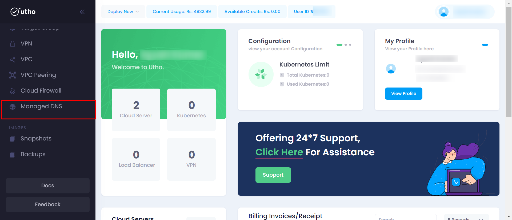
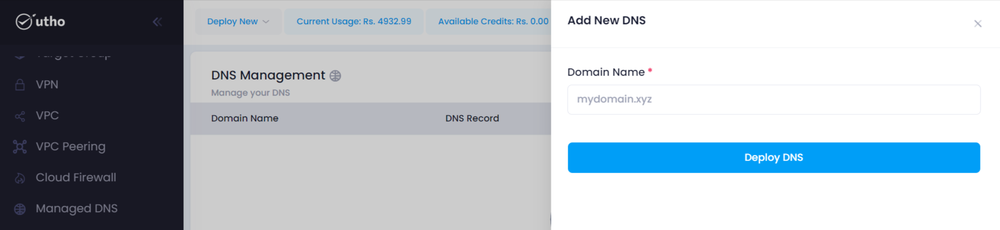
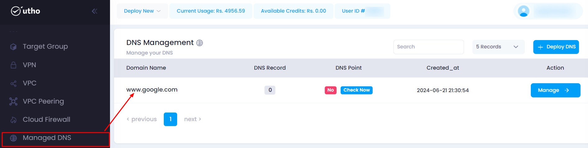
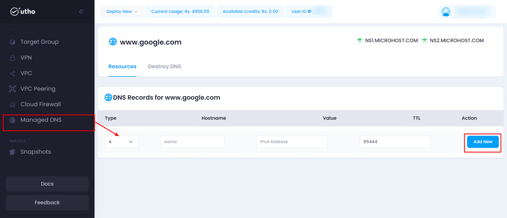

### Initial Start

- Log in to your accout on our platform.
- Navigate to the sidebar here every product is mentioned.
- Select the DNS Management  option from the sidebar.

### Quick Start

1. **Open the DNS Management deployment page:**

- Click on the sidebar and select Monitoring.

After clicking on DNS Management a new page will open.

2. **Configure DNS Management :**
 Here you can configure your DNS Management deployment details after clicking on "**Deploy DNS**."

    

- Fill in these details accordingly:
1. **Domain Name:** Enter a domain name for your DNS.

    And click on Deploy dns.

2. **Verify Deployment**
The created DNS will be seen in the list as marked below.

3. Now after creating the dns click on manage button then a new page will occur where dns configurations will be seen , where we can add dns records after clicking on **Add New.** 

---

