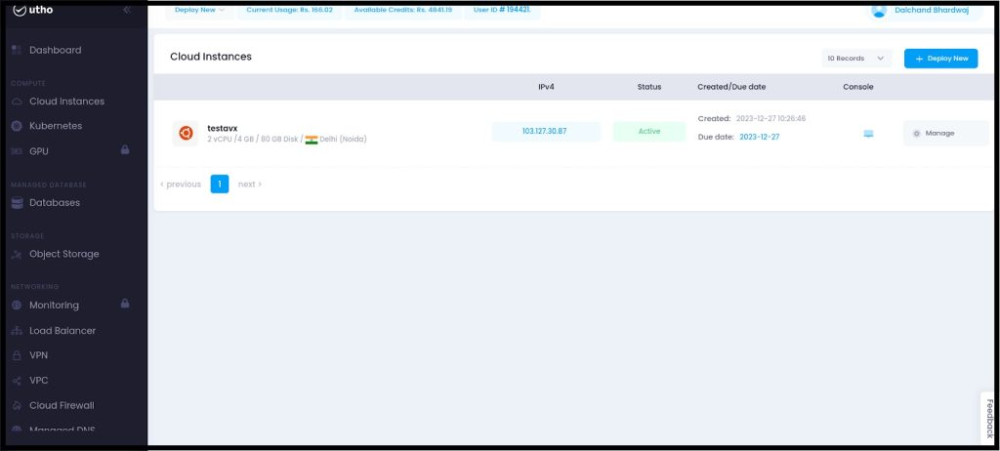
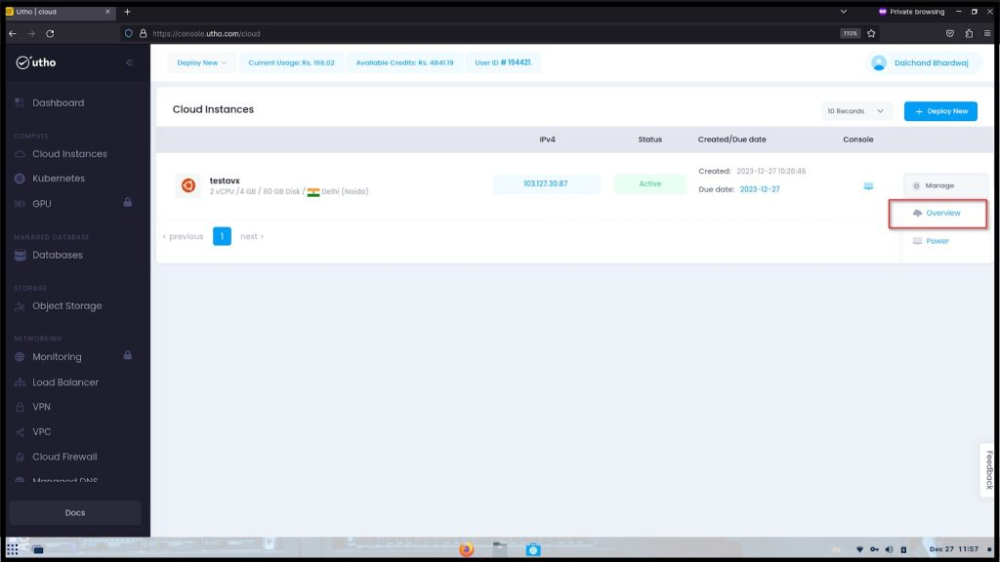
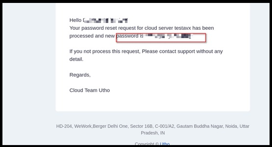

**In the event of a forgotten password, the following steps guide you through the process of resetting your cloud server password for seamless access and security**  

## **Step 1: Login to Utho Cloud Dashboard**  

1.1 Login to your [Utho Dashboard](https://console.utho.com/login)  

## **Step 2: Click on "Instances"**  

2.1 Within the Cloud Dashboard interface, locate the navigation menu.

2.2 Identify and select the "Instances" option.  
  
2.3 Click on the "Instances" link or button to access the dedicated section.  

## **Step 3: Choose the Desired Server and Click on Manage/Overview**  

3.1 Navigate to the "Instances" or relevant section of the Cloud Dashboard.

3.2 Identify and select the specific server from the list.

3.3 Once the server is highlighted, locate and click on the "Manage" or "Overview" option.

## **Step 4: Navigate to the "Power" Tab for Password Reset**  

4.1 Access the server [management](https://utho.com/user-management) interface on the Cloud Dashboard.

4.2 Identify and select the navigation menu or tabs within the interface.

4.3 Locate and choose the "Power" tab.

4.4 Navigate to the "Password Reset" or equivalent option within the "Power" tab.  
  

## **Step 5: **Scroll down and select "Reset Server Password****

5.1 Within the server management interface, locate the relevant section.

5.2 Scroll down to access additional options.

5.3 Identify and select the "Reset Server Password" link.

**Note: Resetting the server password will initiate a server restart.**  

## **Step 6: Receive the New Password on Your Registered Email ID**  

6.1 Following the server password reset, check your registered email inbox.

6.2 Look for an email containing the new password information.

6.3 Get the new password from the email you received and make sure to store it securely.

