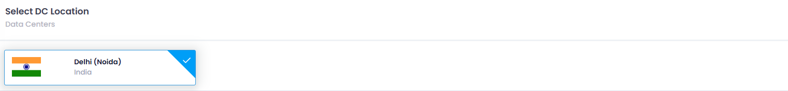
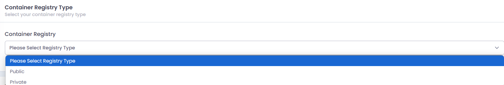
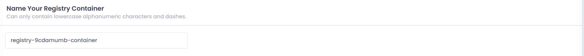

# **How to create Container Registry**

## **Login or Sign Up**

1. Go to the **Utho Cloud Platform** [login](https://console.utho.com/login) page.
2. Enter your credentials and click  **Login** .
3. If you don't have an account, sign up [here](https://console.utho.com/signup).

---

## **Accessing Elastic Block Storage**

1. Open the **Utho Cloud Platform** dashboard.
2. Click on **"Container Registry"** in the sidebar.
3. You will be redirected to the **Container Registry** listing page.
4. Click on **[Create Repository](https://console.utho.com/container-registry ".")** to open the deployment page.

On the  **Deploy Page** , configure the following:

1. - After clicking on **Create Container Registry**  deploy page of CR will open.
   - **Select DC Location**:**DC location** in a **container registry** refers to the **data center location** where the container images are stored. It determines the physical or geographical region of the registry, impacting latency and performance. Choosing the right DC location helps optimize speed, reduce costs, and ensure compliance with data residency regulations.
   - **Container Registry Type:** There are 2 types of container registry
   - **Public Container Registry** : This type of registry allows anyone to access, pull, and use container images. Examples include Docker Hub and Google Container Registry (GCR). It's ideal for open-source projects or sharing images with a wide audience.
   - **Private Container Registry** : This registry restricts access to authorized users or services only. It is used for storing sensitive or proprietary images that need to be kept secure. Examples include AWS Elastic Container Registry (ECR) and Azure Container Registry (ACR).
   - **Name Your Registry Container:**

   1. **Organization** : It helps organize and categorize container images, making it easier to manage and identify different projects, environments, or application versions.
   2. **Access Control** : Naming conventions can be used to enforce access policies, like differentiating between public and private images or separating different teams' images within the same registry.
   3. **Clarity** : A well-named container registry clearly indicates its purpose (e.g.,  **production** ,  **staging** ,  **dev** ), helping teams understand where to push or pull images for specific environments.
   4. **Versioning** : The naming structure can include versioning information, ensuring different versions of the same image can be stored and retrieved easily.
2. Click on the **Create Registry** button to deploy the container registry into your account container registry.

   
3. 
4. **Verify Registry Addition:**

   - Once added, the new container registry should appear in the manage section or in the list of selected (public/private) tab based on the container type selected at deployment time.

