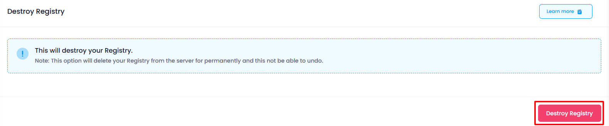

## Destroy Container Registry

In the Destroy section, users can terminate the Container Registry instance. This action is irreversible and will permanently delete the Container Registry and all associated data. To destroy a Container Registry

Click the **Destroy Container Registry** button.

##### **Confirmation:**

A confirmation dialog will appear. Copy the name of the Container Registry and paste it into the input box. Confirm the action to proceed with destroying the Container Registry.

When you provide the confirmation then your Container Registry will destroy.
