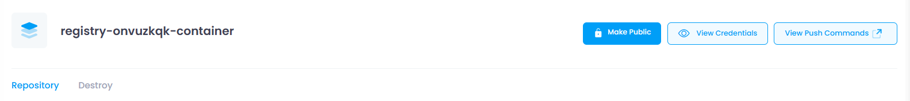

## Overview of manage Section:

At the top of the Manage section, users can view the configuration information of the selected Container Registry. This includes:

### **Container Registry Name**

The **Container Registry Name** is the unique identifier assigned to your container registry. It helps distinguish your registry from others and is used when interacting with the registry for tasks like pushing or pulling container images. This name is usually required when configuring access and setting up automation processes.

### **Make Private/Public**

The **Make Private/Public** option allows you to control the visibility of your container registry. By default, container registries may be private, meaning only authorized users can access the images stored within it. By clicking this button, you can toggle the registry's visibility to  **Public** , making it accessible to anyone, or  **Private** , restricting access to specific users or services.

### **View Credentials**

The **View Credentials** button opens a modal where you can access the login credentials required to authenticate with your container registry. These credentials typically include a **username** and **password** (or an authentication token). Copying these credentials is essential for performing actions such as pushing and pulling container images to and from the registry.

### **View Push Commands**

The **View Push Commands** button opens a drawer that displays the necessary commands to push container images to the registry. These commands typically include instructions for logging in to the registry and uploading an image. Users can copy these commands directly to their terminal or CI/CD pipeline for automating the push process.

### **Repository Section**

A **Repository** in a **Container Registry** is a storage location that holds  **container images** . It organizes and manages the images that are pushed to the registry, often grouped by application or service. Within a repository, multiple versions of a container image are stored and tagged (e.g., `v1.0`, `latest`), allowing users to access or deploy the specific version they need.

### **Destroy Section**

The **Destroy Section** allows users to permanently delete a **Container Registry** or a specific **repository** if it is no longer needed. By clicking the **Destroy** tab, users can initiate the deletion process, which requires confirmation before proceeding. Once destroyed, the registry or repository and its stored images are permanently removed, and the action cannot be undone. This option is useful for cleaning up unused resources and freeing up cloud storage.
