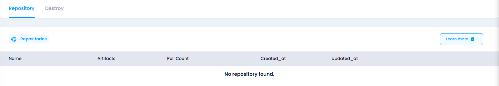

## Manage Repository

In the Manage Repository section, users can view the Repositories and remove the repository. This section provides the following functionalities:

**Pull Count** refers to the number of times a specific container image has been pulled (downloaded) from the registry by users or systems. It provides insight into how frequently the image is being accessed or used in deployments, updates, or development environments.

### Benefits:

1. **Usage Insights** : It helps understand the popularity or demand for a particular container image.
2. **Monitoring and Analytics** : It can assist in tracking which images are actively being used and which may be outdated or underutilized.
3. **Performance Optimization** : High pull counts may indicate frequent deployment or testing, which could prompt optimizations in access speed or caching strategies.

* **Delete:** Click the **Delete** button to remove the repository from the container registory.
