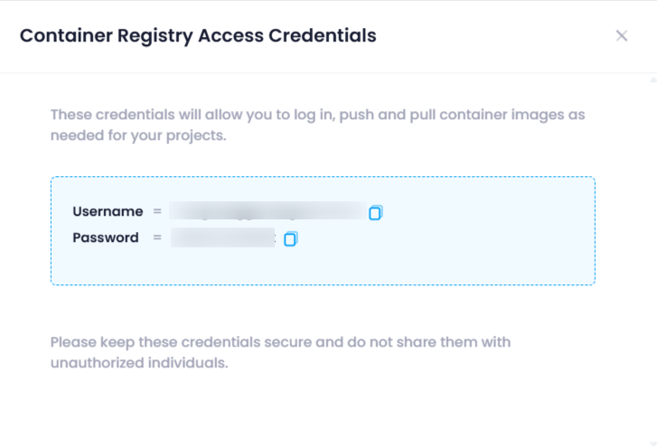

## View Credentials

The **"View Credential"** in a **container registry** allows you to access the authentication credentials needed to interact with the registry. These credentials are essential for securely pulling or pushing container images to and from the registry. Here's how it's useful:

1. **Access Management** : It helps you retrieve the credentials (like username/password or access tokens) required to authenticate your identity when accessing private container images.
2. **Secure Interactions** : Ensures that only authorized users or services can upload or download images from the registry, maintaining security.
3. **Automation** : The credentials provided can be used in **CI/CD pipelines** or automated deployment scripts to enable seamless and secure interaction with the container registry.
