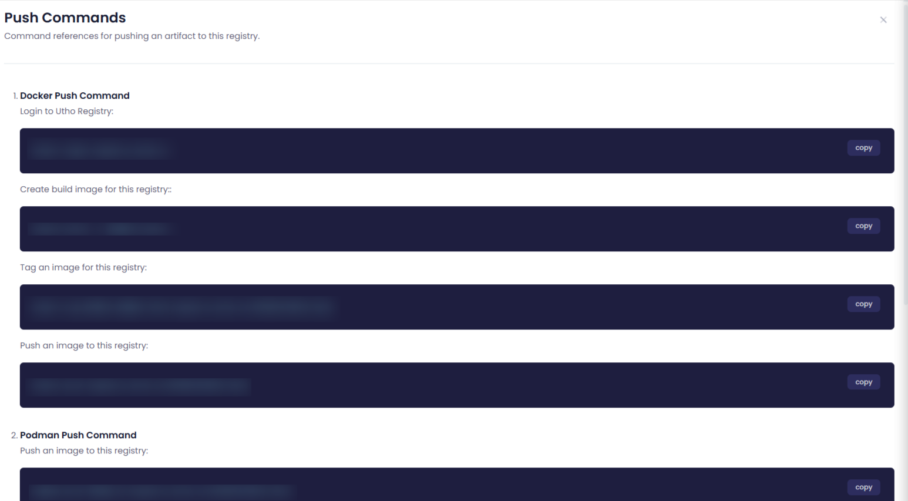

## View Push Commands

The **"View Push Commands"** in a **container registry** provides the necessary commands to upload (push) container images to the registry. It is used to guide users or automation tools in pushing their locally built or modified container images to the registry for storage and deployment. Here's how it's useful:

1. **Simplifies Workflow** : It provides the exact **Docker CLI** commands or tools for pushing images, making it easier for developers to upload images without having to remember complex syntax.
2. **Automation** : The push commands can be integrated into  **CI/CD pipelines** , allowing for automated pushing of container images during build and deployment processes.
3. **Security & Authentication** : The commands typically include necessary authentication steps (e.g., login credentials or token usage), ensuring secure interaction with the container registry.

---
