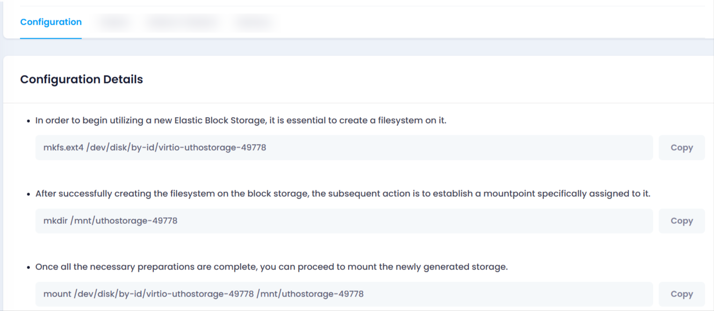

### Configuration Page

Once the Elastic Block Storage (EBS) is created, click on the **Manage** button to be redirected to the **Manage Section**.

**Create a Filesystem**:
First, create a filesystem on your new storage with the command:
`mkfs.ext4 /dev/disk/by-id/virtio-uthostorage-49050`

**Create a Mountpoint** :
Next, create a mountpoint (a folder) to store your data using:

`mkdir /mnt/uthostorage-49050`

**Mount the Storage:** Once the filesystem is ready, mount the storage to the folder with:

`mount /dev/disk/by-id/virtio-uthostorage-49050 /mnt/uthostorage-49050`

**Auto-Mount on Boot:** To automatically mount the storage every time your server starts, add a line similar to the following to your /etc/fstab file.

`/dev/disk/by-id/virtio-uthostorage-49050 /mnt/uthostorage-49050 ext4 defaults,noatime,nofail 0 2 `
