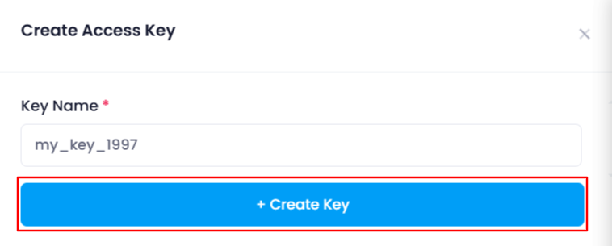
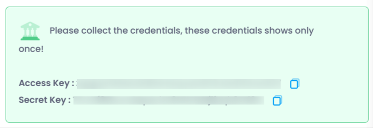
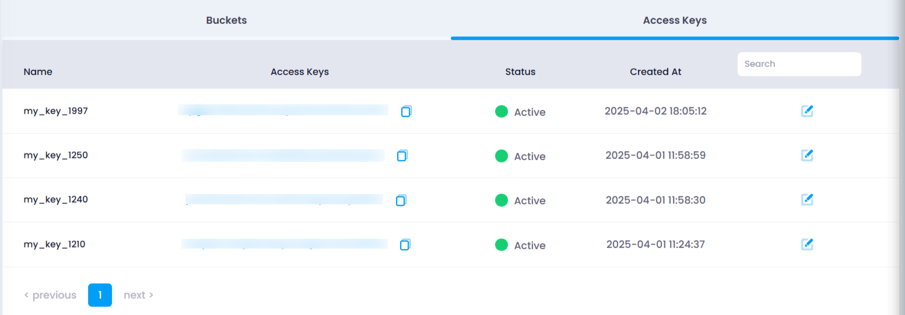

## **Understanding Access Keys**

Before proceeding with deployment, it’s important to understand the role of **Access Keys** in object storage.

### **What are Access Keys?**

Access Keys are credentials required to securely interact with your object storage via APIs or command-line tools. Each access key consists of:

* **Access Key ID** : A unique identifier.
* **Secret Key** : A private key used for authentication.

### **Why Are Access Keys Needed?**

* **Secure Access** : Ensures only authorized users or applications can read/write data.
* **Programmatic Interaction** : Allows developers to integrate object storage with applications, automate backups, or transfer data efficiently.
* **Multiple User Permissions** : You can create separate access keys for different users or applications and manage permissions accordingly.

## **How to create a New Access Key**

To create a new access key:

1. Go to listing page of object storage.
2. Click on the **"Create Access Key"** button.
3. A  **drawer will open** , asking for a  **unique access key name** .
4. Enter a descriptive name (e.g., `backup-key`, `app-storage-key`) to help identify its purpose.
5. Click on the **"Create Key"** button.

   
6. Upon successful creation, the system will display:

   * **Access Key ID**
   * **Secret Key**

     
7. To verify the successful creation of an access key, navigate to the **"Access Keys"** tab on the Object Storage listing page. Your newly created key will appear as the topmost entry in the access key list.
   
