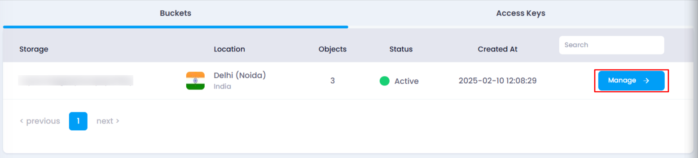
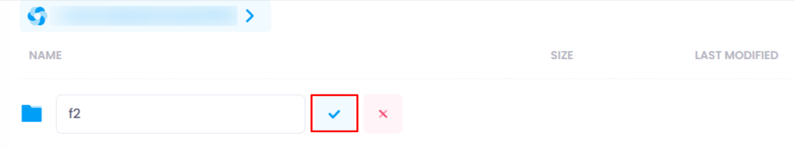
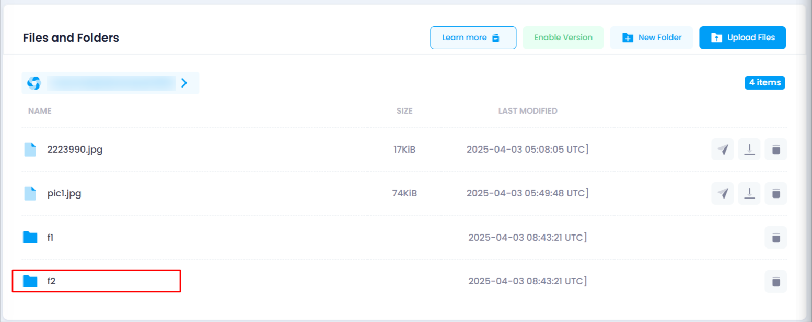

# **How to Create Folders in Object Storage**

You can organize your files in object storage by creating and managing folders. Follow these steps to create a new folder:

### **Steps to Create a Folder:**

1. **Navigate to the Object Storage Listing Page**
   * Go to the object storage section in your account.
   * Or, you can click [here ](https://console.utho.com/objectstorage "Object Storage Listing Page")to directly access the listing page.
2. **Select the Desired Bucket**
   * Locate the bucket where you want to create a folder.
   * Click on the **Manage** button to open the bucket management page.
     
3. **Go to the Object Section**
   * Navigate to the **Object** section, where all files and folders are listed.

     
4. **Create a New Folder**
   * Click on the **New Folder** button.
   * A popover will appear, prompting you to enter a folder name.
   * After entering a valid name, click on the **tick icon** to create the folder.
     
5. **Verify Folder Creation**
   * A success toast notification will confirm that the folder has been created.
   * You can also check the object directory to find the newly created folder.

     

By following these steps, you can efficiently manage and structure your object storage.
