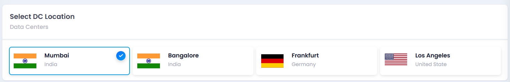
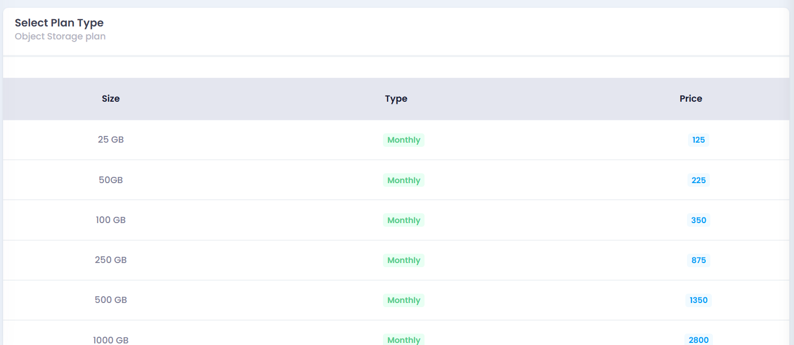
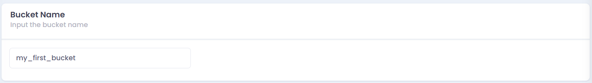
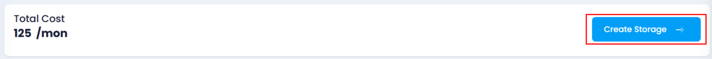
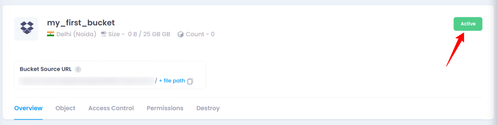

# **How to create object storage bucket**

## **Login or Sign Up**

1. Visit the **Utho Cloud Platform** [login ](https://console.utho.com/login)page.
2. Enter your credentials and click  **Login**.
3. If you’re not registered, sign up [here](https://console.utho.com/signup).

---

## **Step 1: Access the Object Storage Section**

1. Open the **Utho Cloud Platform** dashboard.
2. Click **"Object Storage"** in the sidebar.
3. You’ll be redirected to the  **Object Storage listing page** , where you’ll see:
   * **Buckets** : Displays all deployed object storage instances.
   * **Access Keys** : Lists generated access keys for API interactions.

---

## **Step 2: Create an Object Storage Bucket**

1. Click the **"Create Bucket"** button to start deployment.
2. You will be redirected to the  **Bucket Deployment Page** , where you must configure:
   * **Datacenter Location** : Choose a region where your data will be stored. Selecting a closer region ensures lower latency, better performance, and compliance with data residency regulations.

     
   * **Storage Plan** : Pick a plan based on your storage needs. Plans vary in storage capacity and pricing, allowing flexibility based on your data requirements.

     
   * **Bucket Name** : Enter a **unique name** (lowercase, no spaces) that identifies your storage instance globally.

     

---

## **Step 3: Deploy the Bucket**

1. Review your selected options and the estimated cost.
2. Click **"Create Storage"** to begin deployment.
3. The system will provision your bucket, which may take a few seconds to minutes.

---

## **Verify Your Deployment**

* After deployment, you’ll be **automatically redirected** to the  **Manage Bucket Page** .
* Here, verify that your bucket is successfully created.
* You can check the **status of your deployed instance** in the bucket list.

