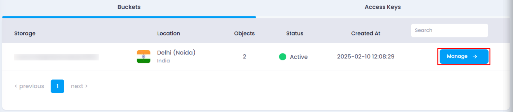
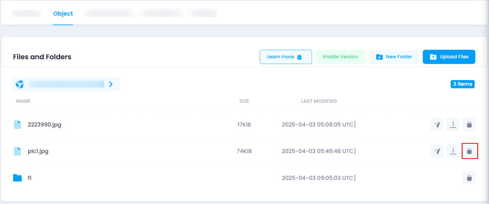
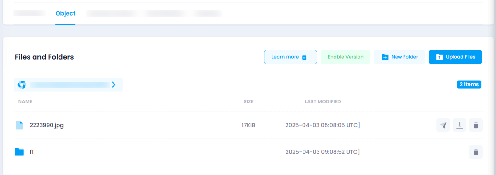

# **How to Delete a File in Object Storage**

You can delete unnecessary files from your object storage by following these steps:

### **Steps to Delete a File:**

1. **Navigate to the Object Storage Listing Page**
   * Go to the object storage section in your account.
   * Or, you can click [here ](https://console.utho.com/objectstorage "Object Storage Listing Page")to directly access the listing page.
2. **Select the Desired Bucket**
   * Locate the bucket containing the file you want to delete.
   * Click on the **Manage** button to open the bucket management page.
     
3. **Go to the Object Section**
   * Navigate to the **Object** section, where all files and folders are listed.
4. **Delete the File**
   * Find the file you want to delete.
   * At the end of the file name, you will see three icons.
   * Click on the **Delete** icon.
   * A confirmation popup will appear.

     
5. **Confirm and Verify Deletion**
   * Click **OK** in the confirmation popup to initiate the deletion process.
   * On success, a toast notification will appear.
   * Verify by checking the object storage directory—if the file is no longer present, it has been successfully deleted.
     

By following these steps, you can efficiently manage and remove unwanted files from your object storage.
