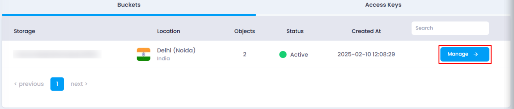
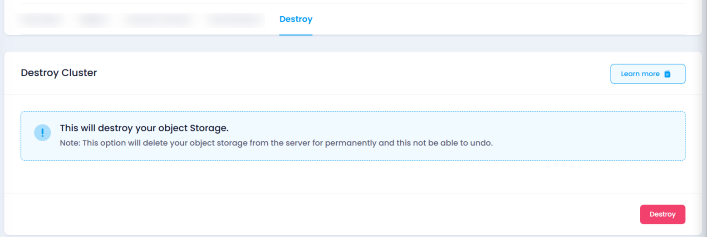

# **How to Destroy Object Storage**

## **Overview**

The **Destroy** feature allows you to permanently delete an object storage bucket and all associated data. This action is irreversible and should be performed with caution.

## **Steps to Destroy an Object Storage Bucket**

1. **Access the Object Storage Listing Page**
   Navigate to the object storage listing page in your account, or you can click [here](https://console.utho.com/objectstorage "Object Storage Listing Page") to directly navigate to the listing page.		
2. **Locate the Target Bucket**
   Identify the bucket you wish to delete from the list.
3. **Open the Management Page**
   Click on the **Manage** button associated with the bucket to navigate to its management page.

   
4. **Find the Destroy Section**
   Look for the **Destroy** section on the page

   
5. **Initiate the Destruction Process**
   Click the **Destroy** button located at the bottom right corner of the page.
6. **Confirm the Action**
   A confirmation popup will appear. Click **OK** to finalize the deletion. This action cannot be undone.

## **Impact of Destroying an Object Storage Bucket**

* **Permanent Deletion:** The bucket, including all stored objects, folders, and associated data, will be permanently removed.
* **Irreversibility:** Once a bucket is destroyed, it cannot be recovered. Ensure you have backed up any critical data before proceeding.

Use this feature responsibly to avoid unintended data loss.
