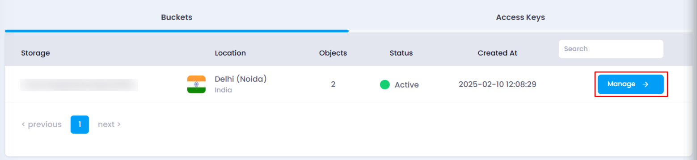
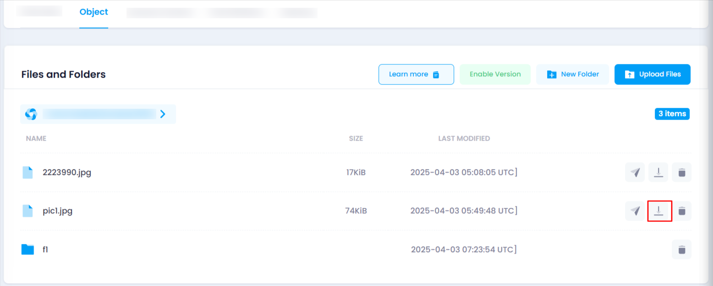
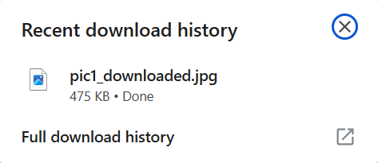

# **How to Download a File from Object Storage**

You can download any file stored in your object storage by following these steps:

### **Steps to Download a File:**

1. **Navigate to the Object Storage Listing Page**
   * Go to the object storage section in your account.
   * Or, you can click[ here](https://console.utho.com/objectstorage "Object Storage Listing Page")  to directly access the listing page.
2. **Select the Desired Bucket**
   * Locate the bucket containing the file you want to download.
   * Click on the **Manage** button to open the bucket management page.
     
3. **Find the File in the Object Section**
   * Navigate to the **Object** section.
   * Locate the file within the directory structure of your object storage.
4. **Download the File**
   * At the end of the file name, three icons will be visible.
   * Click on the **Download** icon to initiate the file download.
     
5. **File Saved to Local System**
   * The file will be automatically downloaded to your local system.
   * You can check your default download folder for the file.

     

By following these steps, you can easily download your stored files for offline access. 🚀
