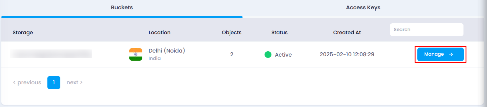
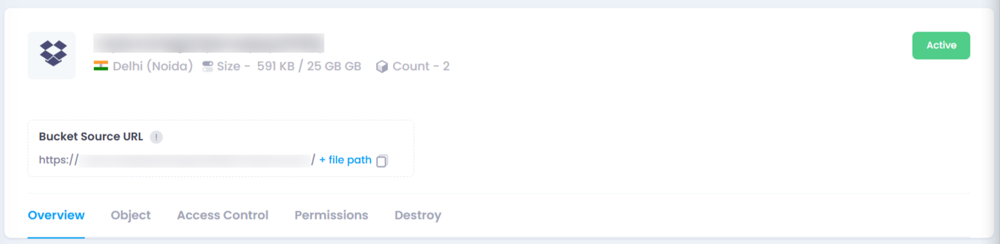

# **Overview of Object Storage**

When an object storage bucket is created, users can view its details and configurations on the **Manage** page. This page provides essential information and various sections to manage the object storage effectively.

### **How to Access the Object Storage Page**

1. **Navigate to the Object Storage Listing Page**
   * Go to the object storage section in your account.
   * Or, you can click [here ](https://console.utho.com/objectstorage "Object Storage Listing Page")to directly access the listing page.
2. **Select the Desired Bucket**
   * Find the bucket whose details you want to view.
   * Click on the **Manage** button to open the object storage page.

     

### **What You Can See on the Object Storage Page**

Once on the **Manage** page, users can view:

* **Bucket Name & Location** – The name of the bucket and its region.
* **Storage Details** – Total storage capacity, occupied space, and object count.
* **Bucket Source URL** – The base URL for accessing objects in the bucket.
* **Status Indicator** – Displays whether the bucket is **Active** or inactive.

  

### **Key Sections in the Object Storage Page**

1. **Overview**
   * Displays essential metrics with graphs like bucket size, storage usage.
2. **Object**
   * Lists all files and folders stored in the bucket.
   * Users can upload, delete, or share files from this section.
3. **Permissions**
   * Shows the access keys with assigned permissions.
   * Users can update or assign new permissions to access keys.
4. **Access Control**
   * Allows users to control how others interact with the bucket.
   * Users can set the bucket as  **Private** ,  **Public** , or **Upload** mode.
5. **Destroy**
   * Provides an option to permanently delete the bucket and its contents.
   * This action is irreversible.

By using these sections, users can efficiently manage their object storage. 🚀
