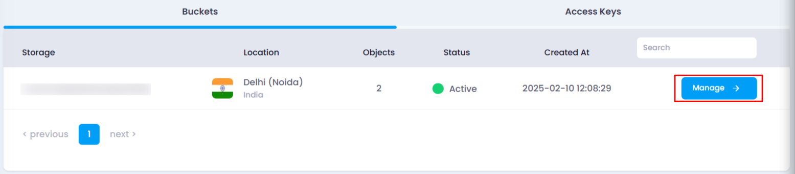
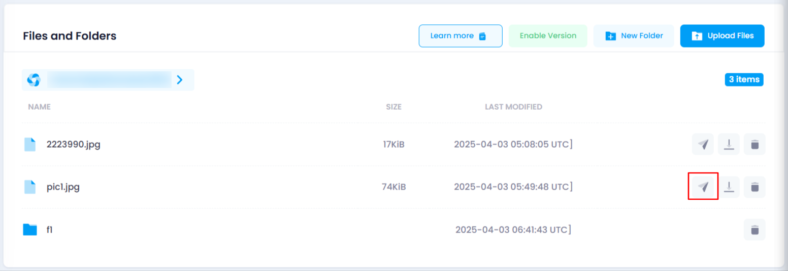
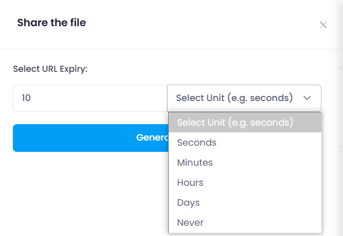
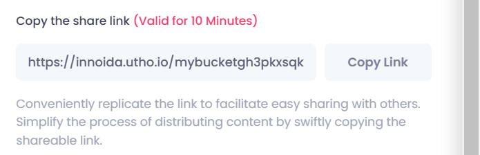

# **How to Share a File from Object Storage**

You can generate a shareable link for any file stored in your object storage by following these steps:

### **Steps to Share a File:**

1. **Navigate to the Object Storage Listing Page**
   * Go to the object storage section in your account.
   * Or, you can click [here ](https://console.utho.com/ojectstorage "Object Storage Listing Page")to directly access the listing page.
2. **Select the Desired Bucket**
   * Locate the bucket containing the file you want to share.
   * Click on the **Manage** button to open the bucket management page.

     
3. **Find the File in the Object Section**
   * Navigate to the **Object** section.
   * Locate the file within the directory structure of your object storage.
4. **Open the Share File Drawer**
   * At the end of the file name, three icons will be visible.
   * Click on the **Share** icon to open the sharing drawer.

     
5. **Set the Expiry Duration**
   * Select the expiry duration for the generated URL using the dropdown.
   * Choose a time unit: **Seconds, Minutes, Hours, Days, Weeks, Months, or Years.**
   * Enter the numeric value for the selected time unit.

     
6. **Generate and Copy the Shareable Link**
   * Click on the **Generate URL** button.
   * The generated link, along with its validity period, will be displayed.
   * Use the **Copy** option below the button to copy the link and share it as needed.

     

By following these steps, you can securely share your stored files with controlled access.
