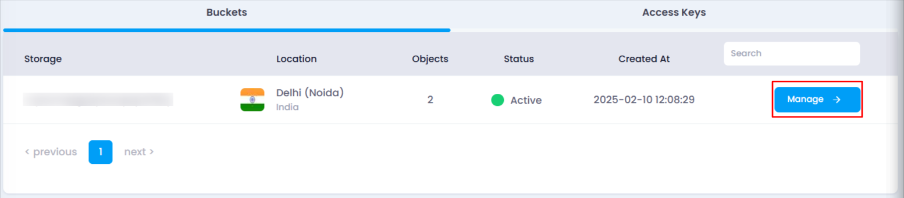
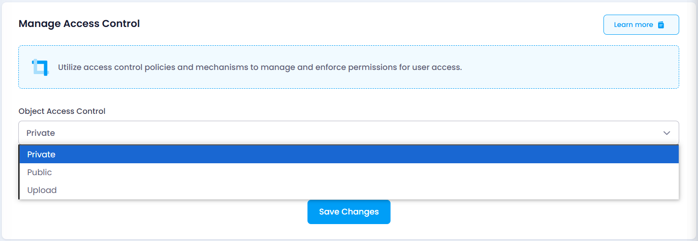

# **How to Manage Access Control for Object Storage**

The **Access Control** section allows you to manage permissions for the objects in your bucket. You can control how users interact with your bucket’s objects by selecting one of the available access levels. Follow these steps to update access control settings:

### **Steps to Manage Access Control:**

1. **Navigate to the Object Storage Listing Page**
   * Go to the object storage section in your account.
   * Or, you can click [here](https://console.utho.com/objectstorage "Object Storage Listing Page") to directly access the listing page.
2. **Select the Desired Bucket**
   * Locate the bucket for which you want to update access control.
   * Click on the **Manage** button to open the bucket management page.

     
3. **Access the Access Control Section**
   * In the **Access Control** section, you will find options to manage object permissions.
4. **Select an Access Control Option**
   * Choose the appropriate option from the dropdown:
     * **Private** – Only you can list, create, overwrite, and delete objects.
     * **Public** – Everyone can list objects, but only you can create, overwrite, or delete them.
     * **Upload** – Everyone can upload objects, but only you can list, create, overwrite, and delete them.

       
5. **Save Changes**
   * After selecting the desired option, click on **Save Changes** button and the changes will be applied.
   * A toast notification will confirm the successful update.

By managing access control settings, you can ensure secure and appropriate access to your object storage.
