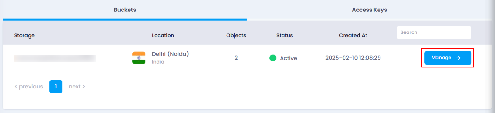
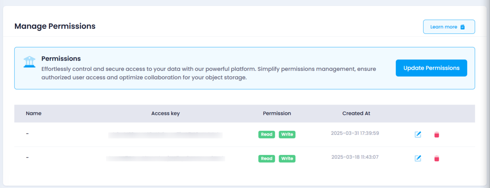
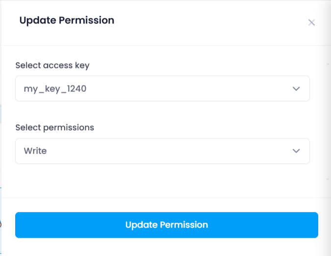
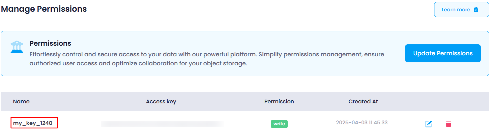

# **How to Update Object Storage Permissions**

You can manage object storage permissions by editing existing permissions or assigning new ones to access keys. Follow these steps to update permissions:

### **Steps to Update Permissions:**

1. **Navigate to the Object Storage Listing Page**
   * Go to the object storage section in your account.
   * Or, you can click [here ](https://console.utho.com/objectstorage "Object Storage Listing Page")to directly access the listing page.
2. **Select the Desired Bucket**
   * Locate the bucket for which you want to update permissions.
   * Click on the **Manage** button to open the bucket management page.

     
3. **Access the Permissions Section**
   * In the **Permissions** section, you will find a list of access keys with assigned permissions.
   * You can edit or delete existing permissions or assign new ones.

     
4. **Assign a Permission to a New Access Key**
   * Click on the **Update Permission** button to open the permissions drawer.
   * Use the first dropdown to select an access key from the available list.
   * Use the second dropdown to select a permission level ( **Read, Write, Read/Write** ).
   * Click on the **Update Permission** button to apply the changes.

     
5. **Verify the Updated Permissions**
   * The new permission will be added to the **Permissions** list on the same page.
   * You can confirm the update by checking for the newly assigned permission in the list.

     

By following these steps, you can effectively manage object storage permissions and ensure proper access control.
