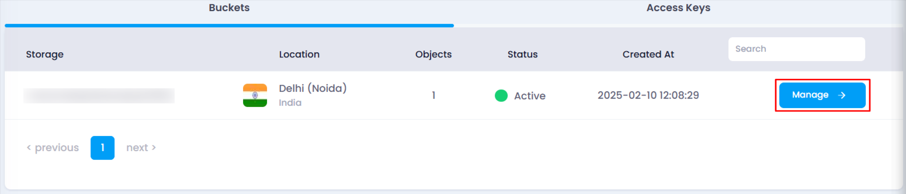
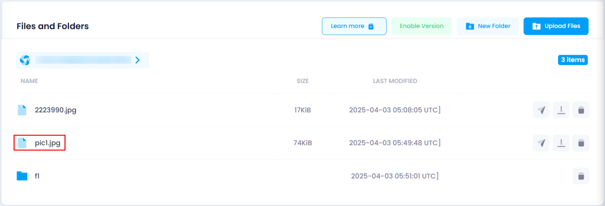

# **How to Upload Files to Object Storage**

You can upload files to your object storage bucket by following these steps:

### **Steps to Upload Files:**

1. **Navigate to the Object Storage Listing Page**
   * Go to the object storage section in your account.
   * Or, you can click [here ](https://console.utho.com/ "Object Storage Listing")to directly access the listing page.
2. **Select the Desired Bucket**
   * Locate the bucket where you want to upload files.
   * Click on the **Manage** button to open the bucket management page.

     
3. **Access the Object Section**
   * On the bucket management page, navigate to the **Objects** section.
   * Files can be uploaded to the root or any selected directory by navigating to it before uploading.
   * Look for the **Upload Files** button.
4. **Attach Files for Upload**
   * Click on the **Upload Files** button to open the upload section.
   * Click on the **Attach Files** button to select files from your system.
5. **Upload the Files**
   * Once the files are selected, click on the **Upload File** button.

     
   * The upload process will begin, and upon successful completion, a toast notification will confirm the upload.
6. **Verify the Uploaded File**
   * Scroll down to the bucket directory structure at the bottom of the page.
   * Locate the uploaded file by checking its name in the directory.

     

By following these steps, you can successfully upload files to your object storage and verify their presence.
