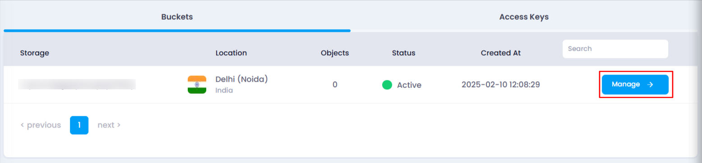
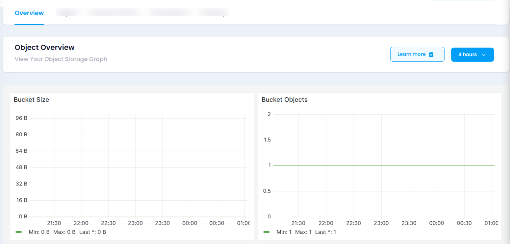

# **How to View Your Object Storage Metrics**

You can monitor the performance and usage of your object storage by accessing its metrics. Follow the steps below to view detailed insights:

### **Steps to View Metrics:**

1. **Navigate to the Object Storage Listing Page**

   * Go to the object storage section in your account.
   * Or, you can click [here ](https://console.utho.com/objectstorage)to directly access the listing page.
2. **Select the Desired Bucket**

   * Locate the bucket for which you want to view metrics.
   * Click on the **Manage** button to open the bucket management page.

     
3. **Access the Overview Section**

   * On the bucket management page, navigate to the **Overview** section.
   * This section provides key storage details and usage statistics.

     
4. **Review Key Metrics**

   The **Overview** section displays essential metrics to help you monitor storage usage:

   * **Total Size of the Bucket** – Displays the overall size allocated to your object storage.
   * **Occupied Storage** – Shows how much storage is in use by the objects in your bucket.
   * **Storage Size Left** – Displays the remaining available storage space.
   * **Number of Objects** – Displays the total number of objects stored in the bucket.

By regularly checking these metrics, you can manage your storage resources efficiently and ensure optimal usage.
