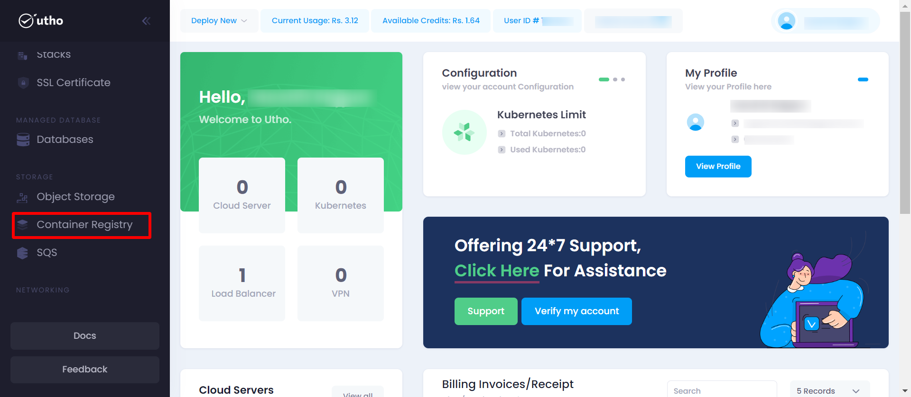
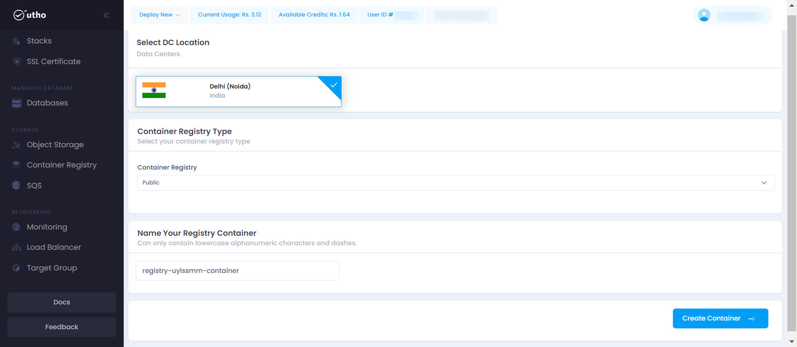
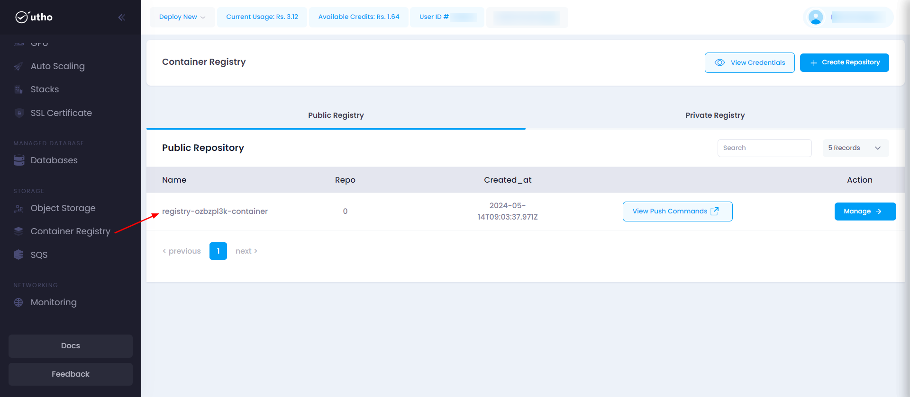

# Initial Start

1. **Navigate to Container Registry Management**
   - Click on "Container Registry" in the sidebar menu.
   - Access the "Create Registry" button.

    

2. **Create Registry**

- Fill in the details: Data Center Location, Container Registry Type, Container Registry Name.
- Click on "Create Registry" to save.

# Quick Start

The purpose of this documentation is to provide a quick guide on how to a create registry within our system.

1. **Open the Container Registry Page:**

   - Click on the **Container Registry** option in the sidebar menu.
   - Click on the **Create Registry** button to initiate the process.

   
   _Screenshot: Add Sub User page showing fields for Data Center Location, Container Registry Type, Container Registry Name._

2. **Fill in Subuser Details:**

   - Enter the following details for the subuser:
     - **Data Center Location:** Select the data center location of the Container Registry.
     - **Container Registry Type:** Select the conatiner registry type like (public,private) of the Container Registry.
     - **Container Registry Name:** Provide the full name of the Container Registry.

3. **Create Registry:**

   - Click on the **Create Registry** button to deploy the container registry into your account container registry.

4. **Verify Subuser Addition:**
   - Once added, the new container registry should appear in the public/private tab based on the container type selected at deployment time.

   
This quick start guide will help you efficiently add and manage container registry.

--- 
<!-- # System Requirements:

- **Operating System:** Windows, macOS, Linux, or mobile OS (iOS, Android)
- **Web Browser:** Latest versions of Google Chrome, Mozilla Firefox, or Microsoft Edge
- **Network:** Active internet connection -->
