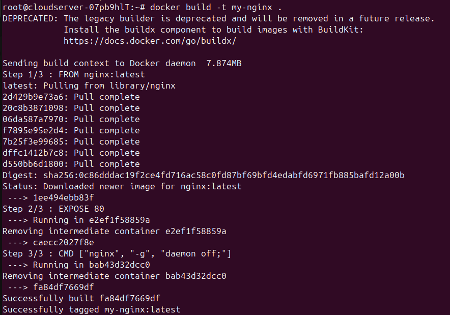
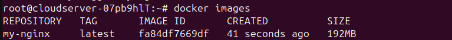
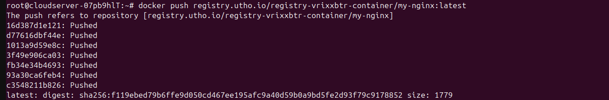
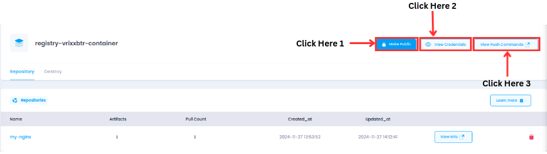
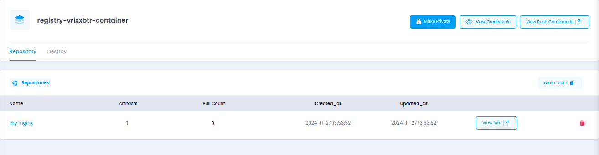
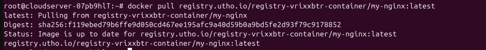

---

title: "How to manage Docker image on Utho Container Registry"
date: "2024-11-27"
title_meta: "How to manage Docker image on Utho Container Registry"
description: "This document provides a detailed step-by-step guide on configuring, managing, and deploying Docker images using the Utho Container Registry. It includes instructions for creating Dockerfiles, building and tagging images, pushing them to the registry, and managing repository settings."
keywords: ["Docker", "Utho Container Registry", "Docker Images", "Dockerfile", "Container Management", "Docker Push", "Docker Pull", "Container Repository", "Docker Deployment", "Registry Configuration"]
tags: ["Utho","Docker", "Utho Registry", "Containerization", "DevOps", "Image Management", "Deployment", "Dockerfile", "Container Registry", "Nginx Configuration", "Docker Commands"]
icon: "Container Registry"
lastmod: "2024-11-27T10:00:00+00:00"
draft: false
weight: 1
toc: true
tab: true

---

## **How to manage Docker image on Utho Container Registry**

This document provides a step-by-step guide on how to configure and manage Docker images on the Utho Container Registry.

---

### **Prerequisites**
- Access to the **Utho Cloud UI**.
- Need to use **Utho Linux Server**.
- Need to use Manage **Container Registry**.  

---

### Deployment Step:

1.**Install `Docker`**

Use the following command to install Docker:
```
apt install docker.io
```
**2.Login to `Utho Container Registry`**

Log in to the Utho Container Registry using your credentials
(**username** and **password**):
```
docker login registry.utho.io
```
---
**3.Prepare Your `Docker File`**

If you do not already have a Docker image, create a Dockerfile. Below is
an example of a simple Dockerfile for an Nginx web server:
```
Vim Dockerfile
```

```bash
 # Use the official Nginx image as the base

 FROM nginx:latest

 # Copy custom configuration or content if needed (optional)

 # COPY ./my-nginx.conf /etc/nginx/nginx.conf

 # COPY ./html /usr/share/nginx/html

 # Expose the default Nginx port

 EXPOSE 80

 # Default command to run Nginx

 CMD \[\"nginx\", \"-g\", \"daemon off;\"\]
```
----

 **4.Build the `Docker Image`**

Build the Docker image using the following command:
```
docker build -t my-nginx .
```


-   Verify the image has been created:
```
docker images
```


**5.Tag the Image for Utho Container Registry**

Use the following command to tag the image for the Utho registry:
```
docker tag SOURCE_IMAGE[:TAG] registry.utho.io/registry-wyccr4cw- container/REPOSITORY[:TAG]
```
`Example:`
docker tag my-nginx:latest registry.utho.io/registry-vrixxbtr-container/my-nginx:latest

This command you will see inside the container registry.so, command
will for a specific container registry.

---
**6.`Push` the Image to the Utho Registry**

Push the tagged image to the registry:
```
docker push registry.utho.io/registry-wyccr4cw-container/REPOSITORY[:TAG]
```
`Example:`docker push registry.utho.io/registry-vrixxbtr-container/my-nginx:latest


Once pushed, your image will be available in the Utho Container
Registry.

---
**7.Managing Your `Repository`:**

This is the registry where your image is pushed.\


 **1.Set Repository Visibility**

-   Go to your Utho Container Registry dashboard.(**Click Here 1**)

-   You can make your repository **`Public`** or **`Private`** by clicking
     the appropriate options.

 **2.Access Credentials**

-   To view your repository credentials, navigate to the credential
     section.(**Click Here 2**)

-   Here, you can find your **`Username`** and **`Password`** for login.

 **3.View Commands**

-   You can find commands for managing your container registry in the
    **`Command`** section.(**Click Here 3**)

 
 **4.Verify `Repository`**

-   Confirm that your repository has been updated with the image
     my-nginx.

-   For additional details, click on **`View Info`** to see the repository
     details.

---
#### **8.`Pull` the Docker Image**

To pull your image from the Utho registry, use the following command:
```
docker pull registry.utho.io/registry-wyccr4cw-container/REPOSITORY[:TAG]
````
 `Example:`docker pull registry.utho.io/registry-vrixxbtr-container/my-nginx:latest



Verify that the image has been successfully pulled.


---