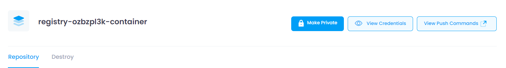
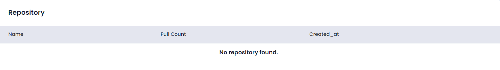
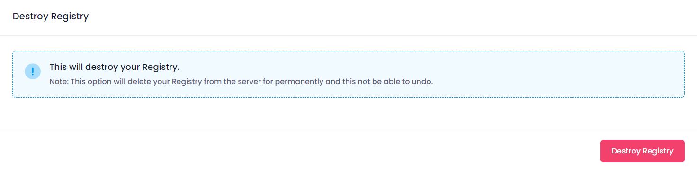
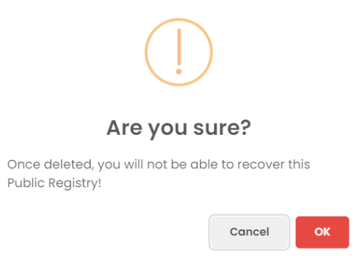

## Container Registry Configuration Info

At the top of the Manage section, users can view the configuration information of the selected Container Registry. This includes:

* **Container Registry Name:** The unique name assigned to the Container Registry.
* **Make Private/Public:** Click the **Make Private/Public** button to change the visibility of your container registry.
* **View Credentials:** Click the **View Credentials** button to open a modal where you can copy the username and password.
* **View Push Commands:** Click the **View Push Commands** button to open a drawer where user can see and copy the commands.

<!-- * **VPC Network:** The number of VPN users associated with the VPN. -->

## Manage Repository

In the Manage Repository section, users can view the Repositories and remove the repository. This section provides the following functionalities:

* **Delete:** Click the **Delete** button to remove the repository from the container registory.

<!-- * **Remove User:** Select a user from the list and click the **Remove** button to remove the user from the VPN.
* **Download User:** Select a user from the list, click the **Download** button, which will download your vpn user into your brows. -->

## Destroy

In the Destroy section, users can terminate the Container Registry instance. This action is irreversible and will permanently delete the Container Registry and all associated data. To destroy a Container Registry

Click the **Destroy Container Registry** button.

##### **Confirmation:**

A confirmation dialog will appear. Copy the name of the Container Registry and paste it into the input box. Confirm the action to proceed with destroying the Container Registry.

When you provide the confirmation then your Container Registry will destroy.
