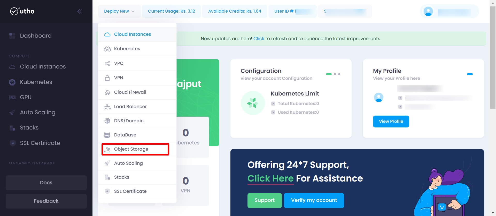
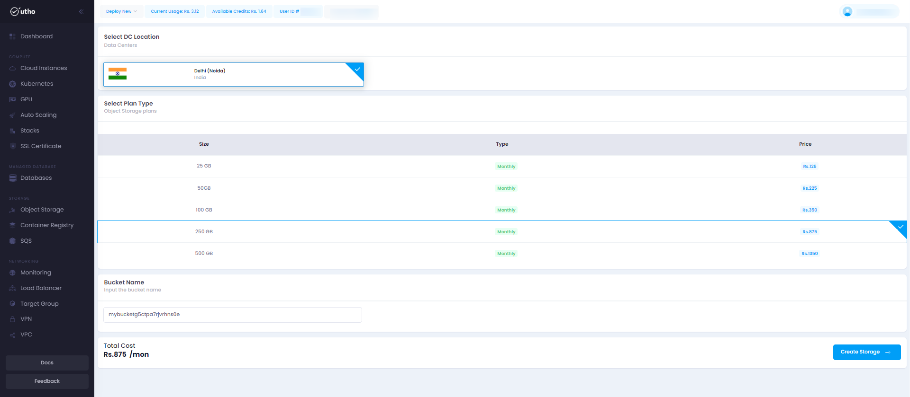
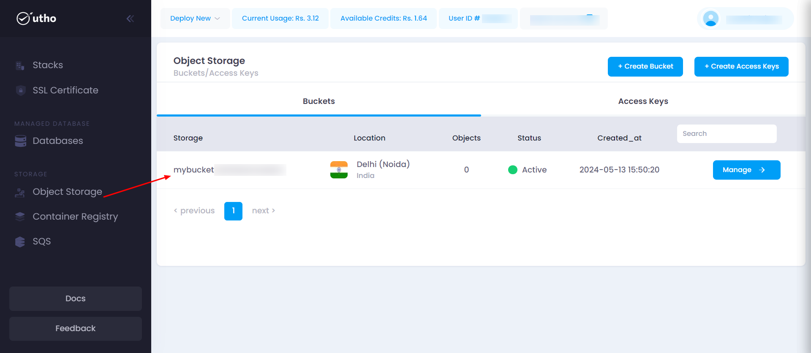
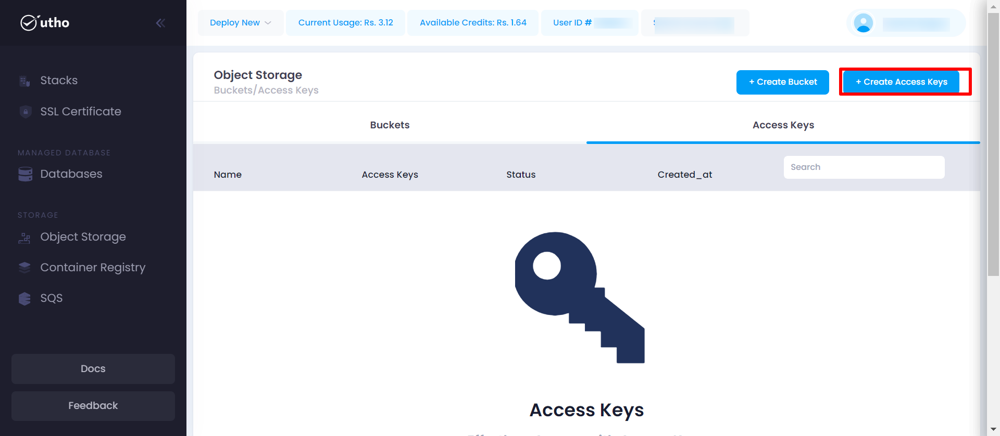
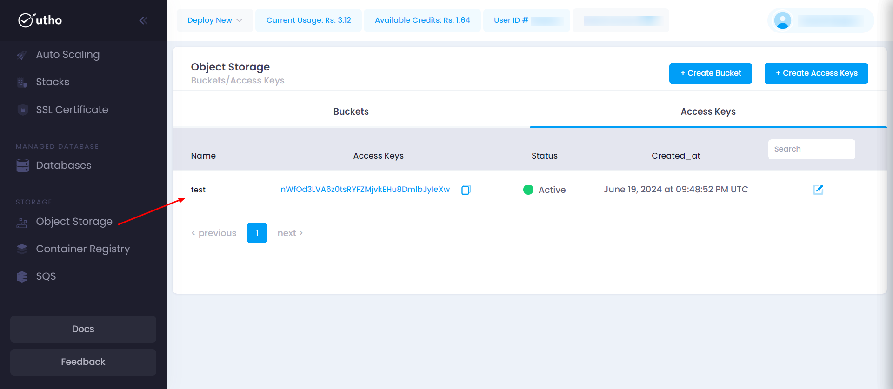

## Initial Start

* **Log in** to your account on our platform.
* **Navigate** to the top toolbar and locate the **Deploy** dropdown menu.
* **Select** the **Object Stroage** option from the dropdown.

## Quick Start

#### Open the Object Stroage Deployment Page:

Click on the **Deploy** dropdown in the top toolbar and select  **Object Stroage** .

After click on the above Object Stroage button a objectstroage-deploy page will open

#### Configure Object Stroage Settings:

here you can configure your object stroage deployment details .

1. **Datacenter Location****:** Choose the desired datacenter location from the dropdown menu.
2. **Object Stroage Name:** Enter a unique name for your Object Stroage.
3. **Billing Plan:** Select the preferred billing Plan.
4. **Deploy Object Stroage:** Click the **Deploy Object Stroage** button on the right side to create your Object Stroage.

#### Verify Deployment:

Your Bucket should now be active and visible in the list of deployed Buckets.

here you can see your deployed Bucket with configuration details your provided during the deployment process and you can manage you Bucket by clicking on mange button, for detailed info check for the manage Bucket section in the Utho docs.

### Create Access Key

Click on the **Create Access Keys** button to open a drawer where you can enter the details such as key name.

* **Create Key:** Click the **Create Key** button to create the acccess key.

#### Verify Deployment:

Your Object Stroage Access key should now be active and visible in the list of deployed Object Stroage Access keys.

here you can see your deployed Access key with configuration details your provided during the deployment process and you can update you Access key by clicking on update icon, for detailed info update for the Access key section in the Utho docs.