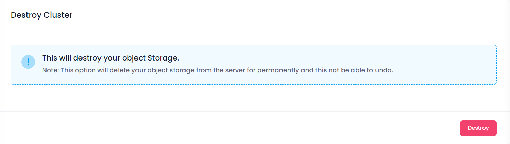
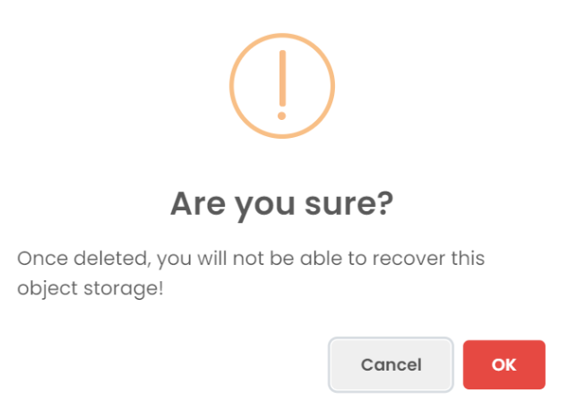

---
weight: 30
title: Destroy
title_meta: "Manage Object Storage on the Utho Platform"
description: "The Manage section allows users to view and update the configuration of their deployed Object Storages. This section provides a comprehensive interface to manage Object Storage users, configure firewalls, and destroy Object Storage instances."
keywords: ["object storage",'storage','bucket', "security"]
tags: ["utho platform","object storage"]
date: "2024-03-07T17:25:05+01:00"
lastmod: "2024-03-07T17:25:05+01:00"
draft: false 
aliases: ['/products/storage/object-storage/manage-object-storage/destroy']
icon: Destroy
tab: true
--- 

In the Destroy section, users can terminate the Object Storage instance. This action is irreversible and will permanently delete the Object Storage.

Click the **Destroy Object Storage** button.

##### **Confirmation:**

A confirmation dialog will appear. Confirm the action to proceed with destroying the Object Storage.

When you provide the confirmation then your Object Storage Instance will destroy.
