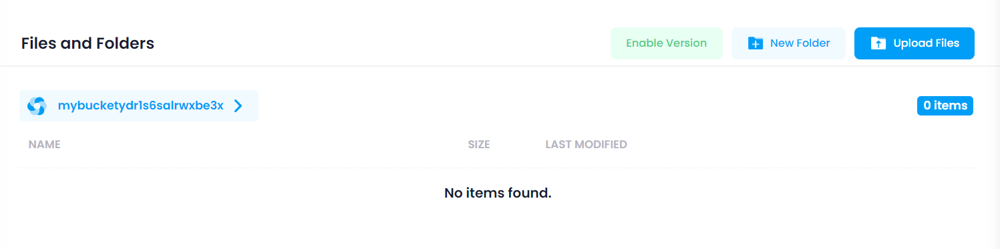

In the Object section, users can upload files and add new folder. This section provides the following functionalities:

* **Upload Files:** Click the **Upload Files** button to open a form where the user can upload files into the object storage.
* **New Folder:** Click the **New Folder** button to open a form where the user can enter the folder name in the input field.

