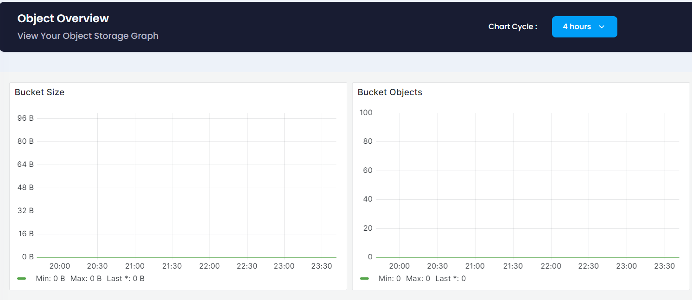

 
In the Overview section, users can see the graph and analyses the use of bucket. This section provides the following functionalities:

* **Chart Cycle:** Select an option from the dropdown menu to filter the data displayed in the graph according to the specified time period. This allows you to view trends and performance metrics over different intervals, such as daily, weekly, monthly.

