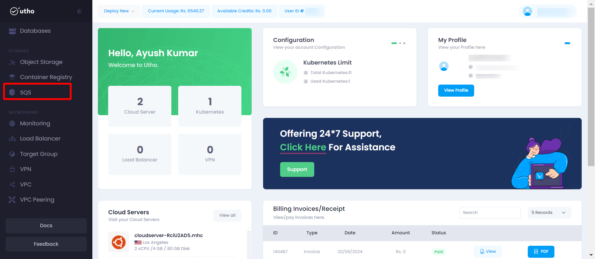
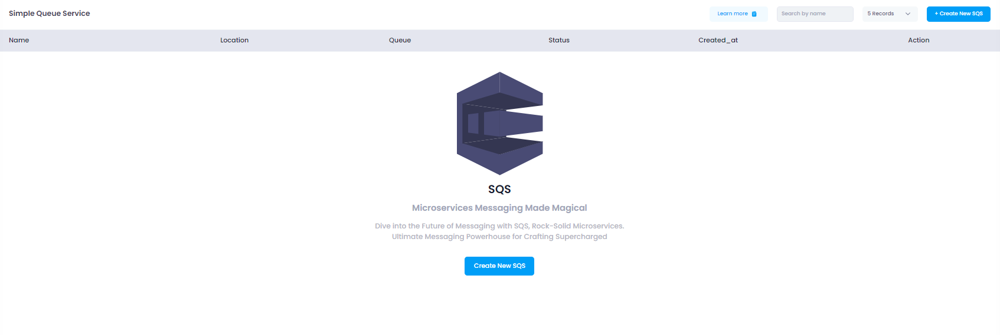
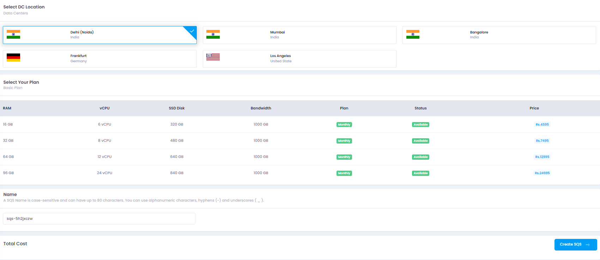

# Initial Start

1. **Navigate to SQS Management**
   

   - In the sidebar menu, click on "SQS".
   - You will be directed to a page displaying a list of all existing SQS queues.
   - This page will have a button labeled **Create New SQS**.

2. **Create a New SQS**
   - Click on the **Create New SQS** button.
   - You will be navigated to the deploy page.

# Quick Start

The purpose of this documentation is to provide a quick guide on how to create and manage SQS queues within the Utho Cloud platform.

1. **Open the SQS Management Page:**

   - Click on the **SQS** option in the sidebar menu.
   - You will see a list of all existing SQS queues.
   - Click on the **Create New SQS** button to initiate the process.

   
   _Screenshot: SQS Management page showing the list of existing SQS queues and the Create New SQS button._

2. **Deploy a New SQS:**

   - On the deploy page, you need to provide the following details:
     - **Data Center Location:** Select the data center location where the SQS will be deployed.
     - **Configuration:** Specify the configuration settings for the SQS queue.
     - **Name:** Provide a unique name for the SQS queue.

   
   _Screenshot: Deploy page showing fields for data center location, configuration, and name._

3. **Create SQS:**

   - Click on the **Create SQS** button to save and create your new SQS queue.

4. **Verify SQS Creation:**
   - Once created, the new SQS queue will appear in the list on the SQS Management page. You can view and manage it from there.

# System Requirements:

- **Operating System:** Windows, macOS, Linux, or mobile OS (iOS, Android)
- **Web Browser:** Latest versions of Google Chrome, Mozilla Firefox, or Microsoft Edge
- **Network:** Active internet connection
